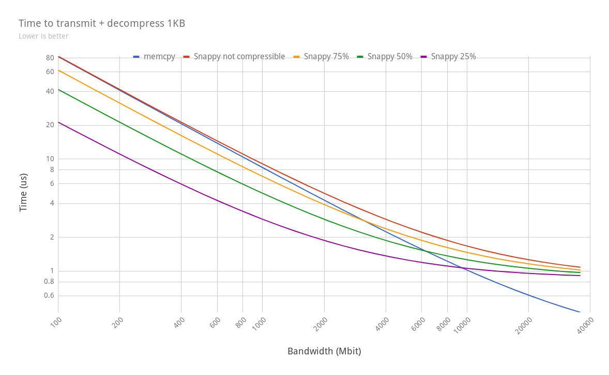

# Meta
* RFC Name: Client-Side Compression
* RFC ID: 0030
* Start Date: 2017-01-03
* Owner: Sergey Avseyev
* Current Status: REVIEW

# Summary
Many of our customers' documents are readily compressible (e.g. JSON text). By
compressing these documents we can store a larger working set in RAM and reduce
network bandwidth.

# Description

Selected compression algorithm: Snappy

Excerpts from the server spec:

> Couchbase Server uses Snappy compression to achieve on-disk compression. To keep
> things simple the first implementation will continue to use Snappy. This removes
> complexity in offline upgrade scenarios handling differently compressed file
> formats.
>
> The solution proposed here does not mandate any given compression algorithm and
> can be adapted to allow others in the future. An independent performance
> comparison of different compression algorithms can be found here (e.g. this
> suggests LZ4 is a worthy contender).
>
> On comparing the different algorithms on the compress, transmit and decompress
> times, at higher network speeds, the total time is dominated by the compression
> and decompression times and the network transmit times makes less of a
> difference. Zstd, in spite better compression ratios, doesn't make the cut due
> to its poor compression and decompression speeds. Lz4 and snappy have comparable
> compression ratios and compression speeds, but lz4 has the edge when it comes to
> decompression speeds.
>
> The following graph plots this data for a range of bandwidth values:
>
> 
>
> Comments:
>
> * ZSTD is faster than memcpy only up to ~600Mb/s; after which point the
>   decompression cost causes the overall time taken to exceed memcpy.
> * LZ4 and Snappy are pretty close below 1Gb/s - both beat ZSTD at ~200Mb/s,
>   and are faster than memcpy.
> * LZ4 is overall the fastest - memcpy only exceeds it at ~9000Mb/s.
> * Snappy the second overall fastest in the gigabit range - memcpy exceeds it
>   at ~4000Mb/s
> * Past ~9000Mb/s, all tested compression algorithms give overall slower
>   results than by simply sending the original data.

# Server Operating modes

The three modes in which compression can be used "off", "passive" and "active"
are configuration settings on the cluster per bucket. Depending on how it is
set, the HELLO negotiation will fail or succeed.

HELLO flag for compression has value `0x0a` and defined as:

    PROTOCOL_BINARY_FEATURE_SNAPPY = 0x0a

|                                                                       | OFF                                  | PASSIVE                      | ACTIVE                                                                                  |
|-----------------------------------------------------------------------|--------------------------------------|------------------------------|-----------------------------------------------------------------------------------------|
| sending SNAPPY feature with HELLO                                     | ignore                               | acknowledge                  | acknowledge                                                                             |
| sending compressed data when SNAPPY feature **enabled**               | -                                    | accept                       | accept                                                                                  |
| sending compressed data when SNAPPY feature **disabled**              | reject as invalid                    | reject as invalid            | reject as invalid                                                                       |
| receiving data which were previously compressed on the server         | server inflates and sends plain data | server sends compressed data | server sends compressed data                                                            |
| receiving data which were **not** previously compressed on the server | server sends plain data              | server sends plain data      | server might send compressed data. (the compression is done in background on the server |

The server might change compression settings for the bucket in any time, but it
is guaranteed that once the socket negotiate compression through HELLO, the
server will never reject compressed data, even if the bucket setting has been
changed.

For the first iteration, the SDK have to compress only mutation operations:
SET/ADD/REPLACE/APPEND/PREPEND.

When the snappy has been successfully negotiated, the server might send
compressed data in response to any of the commands. So the **SDK MUST check
datatype for every response it receives** and inflate the payload if SNAPPY flag
set.

The diagrams below use **"VVV"** to represent source/uncompressed data, and
**"ZZZ"** to represent compressed data.

## OFF ("legacy" - default for upgraded buckets).

The server still acknowledge SNAPPY hello flag. The SDK allowed to send
compressed data, but it will be actively decompressed by the server and it will
return inflated data in subsequent get responses.

    +-----+                                               +----+
    |     |                                               |    |
    | SDK |                                               | KV |
    |     |                                               |    |
    +-----+                                               +----+
          |                                               |
          |HELLO {SNAPPY}                                 |
          +---------------------------------------------->>
          |                                               |
          <<----------------------------------------------+
          |                                 HELLO {SNAPPY}|
          |                                               |
          |                                               |
          |                                               |
          |SET "K1", "ZZZ", DT={SNAPPY}                   |
          +---------------------------------------------->>
          |                                               |
          <<----------------------------------------------+
          |                                            OK |
          |                                               |
          |GET "K1"                                       |
          +---------------------------------------------->>
          |                                               |
          <<----------------------------------------------+
          |                                   "VVV", DT={}|
          |                                               |
          |SET "K2", "VVV", DT={}                         |
          +---------------------------------------------->>
          |                                               |
          <<----------------------------------------------+
          |                                            OK |
          |                                               |
          |GET "K2"                                       |
          +---------------------------------------------->>
          |                                               |
          <<----------------------------------------------+
          |                                   "VVV", DT={}|
          |                                               |

    +-----+                                               +----+
    |     |                                               |    |
    | SDK |                                               | KV |
    |     |                                               |    |
    +-----+                                               +----+
          |HELLO {}                                       |
          +---------------------------------------------->>
          |                                               |
          <<----------------------------------------------+
          |                                       HELLO {}|
          |                                               |
          |GET "K1"                                       |
          +---------------------------------------------->>
          |                                               |
          <<----------------------------------------------+
          |                                   "VVV", DT={}|

## PASSIVE (default for new buckets)

The server acknowledges SNAPPY hello flag. Also accepts and understands values
with SNAPPY datatype. But do not compress all values automatically for SDK. It
returns compressed data only when the document was previously sent
compressed. Also it decompress automatically if SDK does not negotiate SNAPPY
hello flag.

    +-----+                                               +----+
    |     |                                               |    |
    | SDK |                                               | KV |
    |     |                                               |    |
    +-----+                                               +----+
          |                                               |
          |HELLO {SNAPPY}                                 |
          +---------------------------------------------->>
          |                                               |
          <<----------------------------------------------+
          |                                 HELLO {SNAPPY}|
          |                                               |
          |                                               |
          |                                               |
          |SET "K1", "ZZZ", DT={SNAPPY}                   |
          +---------------------------------------------->>
          |                                               |
          <<----------------------------------------------+
          |                                            OK |
          |                                               |
          |GET "K1"                                       |
          +---------------------------------------------->>
          |                                               |
          <<----------------------------------------------+
          |                             "ZZZ", DT={SNAPPY}|
          |                                               |
          |SET "K2", "VVV", DT={}                         |
          +---------------------------------------------->>
          |                                               |
          <<----------------------------------------------+
          |                                            OK |
          |                                               |
          |GET "K2"                                       |
          +---------------------------------------------->>
          |                                               |
          <<----------------------------------------------+
          |                                   "VVV", DT={}|
          |                                               |

    +-----+                                               +----+
    |     |                                               |    |
    | SDK |                                               | KV |
    |     |                                               |    |
    +-----+                                               +----+
          |HELLO {}                                       |
          +---------------------------------------------->>
          |                                               |
          <<----------------------------------------------+
          |                                       HELLO {}|
          |                                               |
          |GET "K1"                                       |
          +---------------------------------------------->>
          |                                               |
          <<----------------------------------------------+
          |                                   "VVV", DT={}|

## ACTIVE

The same as passive, but the server will actively compress data, so the SDK
might receive documents compressed, which were sent uncompressed previously.

    +-----+                                               +----+
    |     |                                               |    |
    | SDK |                                               | KV |
    |     |                                               |    |
    +-----+                                               +----+
          |                                               |
          |HELLO {SNAPPY}                                 |
          +---------------------------------------------->>
          |                                               |
          <<----------------------------------------------+
          |                                 HELLO {SNAPPY}|
          |                                               |
          |                                               |
          |                                               |
          |SET "K1", "ZZZ", DT={SNAPPY}                   |
          +---------------------------------------------->>
          |                                               |
          <<----------------------------------------------+
          |                                            OK |
          |                                               |
          |GET "K1"                                       |
          +---------------------------------------------->>
          |                                               |
          <<----------------------------------------------+
          |                             "ZZZ", DT={SNAPPY}|
          |                                               |
          |SET "K2", "VVV", DT={}                         |
          +---------------------------------------------->>
          |                                               |
          <<----------------------------------------------+
          |                                            OK |
          |                                               |
          |GET "K2"                                       |
          +---------------------------------------------->>
          |                                               |
          <<----------------------------------------------+
          |                             "ZZZ", DT={SNAPPY}|

    +-----+                                               +----+
    |     |                                               |    |
    | SDK |                                               | KV |
    |     |                                               |    |
    +-----+                                               +----+
          |                                               |
          |HELLO {}                                       |
          +---------------------------------------------->>
          |                                               |
          <<----------------------------------------------+
          |                                       HELLO {}|
          |                                               |
          |GET "K1"                                       |
          +---------------------------------------------->>
          |                                               |
          <<----------------------------------------------+
          |                                   "VVV", DT={}|

# Configuration

## `compression`

The SDK must have snappy compression enabled by default, but allow user to
disable it. Optionally the SDK might implement third state to force compressing
data even if the feature hasn't been negotiated for the server.

## `compression_min_size`

The minimal size of the document to consider compression. The documents, which
size below this value must be sent as is. The default is `32` bytes.

## `compression_min_ratio`

The minimal compress ratio (`compressed / original`) for the document to be
sent. The default is `0.83` (as the server). Note that the library should not send
documents where compression ratio is greater or equals than 1.0, as in this case
compressed document is greater than original.

## Language specifics

### C

* connection string. According to RFC: `"compression=on"`, `"compression=off"`,
  optional: `"compression=force"`, `"compression=deflate_only"` (only compress
  outgoing data), `"compression=inflate_only"` (only decompress incoming data).

* `lcb_cntl(instance, LCB_CNTL_SET, LCB_CNTL_COMPRESSION_OPTS, &opts);` where opts is one of the:
  * `LCB_COMPRESS_NONE`
  * `LCB_COMPRESS_IN`
  * `LCB_COMPRESS_OUT`
  * `LCB_COMPRESS_INOUT`
  * `LCB_COMPRESS_FORCE`

### PHP

Derived from libcouchbase, connection string: `"compression=on"`,
`"compression=off"`, optional: `"compression=force"`,
`"compression=deflate_only"` (only compress outgoing data),
`"compression=inflate_only"` (only decompress incoming data).

### Java

On, by default, can be disabled with the system property
`"com.couchbase.snappyEnabled"` to `"false"` which will avoid the feature
negotiation. Note that it would still best effort decode if the snappy bit comes
along on the response! But it logs a debug log in this case, since its not
expected.

### .NET

Likely going to be additional nuget package - need to figure out how we'll
enable via config.

Aim is to be on by default and can be disabled with configuration property
`"SnappyCompressionEnabled"` set to `"false"` which will avoid feature
negotiation.

NOTE: There is not official library that supports both net45 and netcore. We
need to investigate a solution for cross-platform. And .NET client might be
implementing its own wrapper around C library.

### Node.js

Uses internal libcouchbase support and follows its behaviour precisely.

### Go

On, by default, can be disabled by using `compression=off` in the connection
string.

### Python

On by default, but can be set via connection string as per libcouchbase, or via
`couchbase.bucket.Bucket.compression` property, with one of:

* `COMPRESS_NONE`
* `COMPRESS_IN`
* `COMPRESS_OUT`
* `COMPRESS_INOUT`
* `COMPRESS_FORCE`

# SDK implementation details

* SDK is not allowed to send compressed data until it will be negotiated for
  this particular network channel. This means, the application cannot
  proactively put compressed data to output network buffers before socket
  connection established and hello flags negotiated.

* SDK should carefully re-route or retry network buffers, which might contain
  compressed data. And check that the compression has been negotiated for new
  server endpoint, otherwise, it should rebuild buffer.

* The compression datatype should not be visible to the user's
  application. I.e. it have to be set only when operation (or document) leaves
  user control (after transcoding), and it should be reset after decompression
  response from the network buffer.

# Signoff

| Language | Representative      | Date       |
|----------|---------------------|------------|
| C        | Sergey Avseyev      | 2018-03-14 |
| Go       | Brett Lawson        | 2018-04-24 |
| Java     | Michael Nitschinger | 2018-03-25 |
| .NET     | Jeff Morris         | 2018-04-25 |
| Node.js  | Brett Lawson        | 2018-04-24 |
| PHP      | Sergey Avseyev      | 2018-03-14 |
| Python   | Ellis Breen         | 2018-03-14 |
