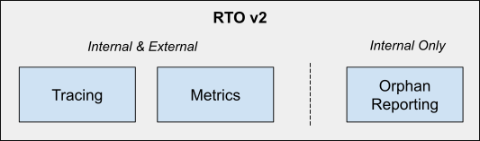
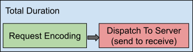

# Extended SDK Observability

## (RTO v2)

# Meta

* RFC Name: Extended SDK Observability (RTO v2)
* RFC ID: 67
* Start Date: 2020-09-07
* Owner: Michael Nitschinger
* Current Status: DRAFT

# Summary

This RFC describes extended tracing, metrics and orphan reporting support, superseding [RFC 35 (RTO)](https://github.com/couchbaselabs/sdk-rfcs/blob/master/rfc/0035-rto.md).

# Motivation

In 2017 it became clear that the SDKs needed to provide more insight into their inner workings to help debug performance problems (i.e. latency spikes or reduced throughput) in production. At that time, we worked closely with the [OpenTracing](https://opentracing.io/) project and found it to be a great foundational library to build our own work on top. All of this work culminated in [RFC 35 (RTO)](https://github.com/couchbaselabs/sdk-rfcs/blob/master/rfc/0035-rto.md) and is currently implemented in the "SDK 2" series.

Over the last three years many customers deployed RTO v1 in production and we were able to gather positive and negative feedback. In addition, OpenTracing merged with OpenCensus into [OpenTelemetry](https://opentelemetry.io/), which in turn requires adaptations on the SDK side as well going forward.

This RFC’s main motivation is to propose an extension of RTO v1 and apply lessons learned, extend it with new capabilities and fix those parts which haven’t been perfect previously. Because it is a bigger topic, this RFC completely supersedes RFC 35 and acts as the single source of truth for future implementations.

> [!NOTE]
> During initial SDK 3 development, RFC 60 also got started with a similar motivation, but due to time constraints it never got to where it needed to. Both new implementations and those who loosely followed RFC 60 should converge on this document going forward.

# General Design

## Overview

Since response time observability is an umbrella term used to describe many different capabilities of the SDK, this section tries to provide an overview of each component and how they fit into the bigger picture.



* **Request Tracing**
  The tracing capability allows the SDK to store, aggregate and potentially forward information about an individual request which can be used for later analysis. This information can include the time it took to encode it, how much time it spent on the wire, etc.

* **Observability Metrics**
  The SDK collects information which is not tied to an individual request but rather to a collection of them (i.e. requests per second on a specific socket) or concerning the environment the SDK is running in (i.e. garbage collection timings, CPU usage, etc.).

* **Orphaned Response Reporting**
  Special reporting capabilities which explicitly collect information about responses which have been abandoned (i.e. timed out) at the time when the SDK tries to complete them.

The difference between "internal only" and "internal & external" as shown in the picture above is that the orphan reporter does not provide APIs to hook it up to external APIs (like OpenTelemetry).  It writes only to the user configured logger.

The next sections cover each component in greater detail.

## Request Tracing

Collecting information about an individual request and its response is an essential feature of every observability stack.

In practice, the SDK finds itself in two kinds of deployments:

* The host application does not capture this kind of information in a holistic manner and therefore SDK information is looked at in isolation.

    This case requires the SDK to aggregate information internally and then log it at regular intervals, since the user application usually has no other means of extracting it in production.

* The host application already captures tracing-related information throughout its stack and as a result the SDK is a single piece in the puzzle.

    In this case the SDK needs to expose its tracing information to an external API (i.e. OpenTelemetry) which allows the user to consolidate every trace information in a central downstream system (i.e. [Jaeger](https://www.jaegertracing.io/)). Also, there are many competing downstream libraries available on the market, and we cannot implement/maintain compatibility to all of them.

Based on this, **two core requirements** are formulated:

1. A vendor-neutral API must be provided where external tracing implementations can be attached to.
2. A default implementation must exist which does not rely on an external system to provide vital tracing information to the user.

> [!NOTE]
> Readers who are familiar with RTO v1 will recognize that this is very similar to what we had before. You are right\! The only real difference is the "vendor-neutral" bit. We’ve been burned by OpenTracing becoming EOL and we do not know what will happen to OpenTelemetry in 5 years down the road. Implementing our own interfaces allows us to be pluggable with many different systems in the future and not be locked into one library we have very limited control over.

The SDK captures the following time durations (spans) for each individual request:



* **Total Duration**

  The time it takes from when the request is created inside the client to when it is completed and the response has been returned to the caller.

* **Request Encoding**

  The time it takes to encode the content of the request (for example JSON marshalling). Depending on the request type this might not be present (i.e. for a get request).

* **Dispatch To Server**

  The time it takes from when the client sends the already fully encoded request "onto the network". Depending on the platform this might mean different things, but it will very likely at least include the client OS networking stack, the network itself and the full processing time on the server. It might also include any I/O framework that is used.

It does not include response decoding, because in SDK 3 a \*Result object is returned to the user which then performs the decoding at some later point. Since usually the SDK does not know when the decoding happens, for performance reasons it cannot keep the overall trace information around "forever", since the user might never actually perform a decode operation.

In addition to the duration of the individual phases, the SDK also captures contextual information about each request (i.e. operation id, peer address, local address, etc.). See the corresponding section in [Implementation Details](#implementation-details) for more information.

## Observability Metrics

Individual request traces present a very specific (and isolated) view of the system. In addition, it also makes sense to capture information that aggregates request data (i.e. requests per second), but also data which is not tied to a specific request at all (i.e. resource utilization).

The deployment situation itself is similar to the tracer: either applications already have a metrics infrastructure in place or they don’t. The difference is that exposing some kind of metrics is much more common than request based tracing, because most production deployments at least monitor CPU usage etc.

Still, the **core requirements** are the same:

1. A vendor-neutral API must be provided where external metrics implementations can be attached to.
2. A default implementation must exist which does not rely on an external system to provide vital metrics information to the user.

Metrics are grouped into three categories:

* **Request/Response Metrics** (i.e. requests per second)
* **SDK Metrics** (i.e. how many open collections, various queue lengths)
* **System Metrics** (i.e. cpu usage, garbage collection performance)

It is important to understand that especially on the request/response metrics, each metric is also annotated with additional contextual information (for example service type, remote hostname, etc) which allows it to be aggregated in downstream systems in various ways. It is important to find the right balance between being able to extract the proper information vs. increasing the cardinality too much.

Also, system metrics should be enabled/disabled separately to avoid collecting information many times if the user already has those metrics gathered separately.

See the respective section in [Implementation Details](#implementation-details) for more information.

## Orphaned Response Reporting

Orphan response reporting acts as an auxiliary tool to the tracing and metrics capabilities. It does not expose an external API to the application and is very focussed on its feature set.

The way it works is that every time a response is in the process of being completed, when the SDK detects that the original caller is not listening anymore (likely because of a timeout), it will send this "orphan" response to a reporting utility which then aggregates it and in regular intervals logs them in a specific format.

When the user then sees timeouts in their logs, they can go look at the output of the orphan reporter and correlate certain properties that aid debugging in production.  For example, if a single node is slow but the rest of the cluster is responsive, this would be visible from orphan reporting.

See the respective section in [Implementation Details](#implementation-details) for more information.

# Implementation Details

This section covers the implementation details of each specific feature. Language specific extensions and exemptions are covered in [Language Specifics](#heading=h.h8p6ffqxij2g).

## Request Tracing

The RequestTracer interface is the main abstraction and central place to handle tracing information. Note that while it is not an internal class, it is not one that a normal user would use directly \- but instead use either the default implementation or adapters we ship. Advanced users can build their own implementations of the interface.

```
interface RequestTracer {
	RequestSpan requestSpan(String name[, RequestSpan parent]);
}
```

* `requestSpan`
  * Returns: `RequestSpan`
  * Args:
    * name: `String` (required)
    * parent: `RequestSpan` (optional)

Since errors from the underlying APIs can be very specific to the implementation/platform used, they should be wrapped in a `TracerException`. See the error section for specific details on the error.

To create a new RequestSpan (which tracks a certain timespan of the operation), calling the appropriate method on the RequestTracer will provide one. Note that a span name is required, and optionally a parent span can be provided which allows the tracers to build span sequences.

```
interface RequestSpan {
	void setAttribute(String key, String | Number | Boolean value)
	void addEvent(String name\[, Instant timestamp\])
	void setStatus(StatusCode code)
	void end();
}
```

* `setAttribute`
  * Returns: void
  * Args:
    * key: String (required)
    * value: String or Number or Boolean (required)

* `addEvent`
  * Returns: void
  * Args:
    * name: String (required)
    * timestamp: Instant (must use current epoch if not provided otherwise by the caller)

* `setStatus`
  * Returns: void
  * Args:
    * status: `StatusCode` (required)
      `StatusCode` is an enum with the following values:
      * `Unset` (default value)
      * `Ok`
      * `Error`

* `end`
  * Returns: void
  * Args:
    * tracer: `RequestTracer` (the corresponding tracer instance) (required)

The following semantics are important:

* A `RequestSpan` **must** be finished so that it is recognized in downstream components.
* Events, Attributes or Status might not be supported by the underlying implementation. In this case they are silently ignored.

In addition to an end method, it is possible that a language equivalent of a `Closeable` is implemented as well to make it more streamlined where needed.

Also, the prefixes like "set" and "add" can be avoided to fit the language best practices.

### Default Implementation: ThresholdLoggingTracer

The `ThresholdLoggingTracer` is the default implementation of the RequestTracer interface and always used if not overridden by the user. As the name suggests, it collects request trace information if they are over a configurable threshold and logs the aggregated information at regular intervals.

The internal implementation is not specified in this RFC since it is very language specific, although key requirements are outlined below which must be satisfied:

1. The impact on the hot code path must be kept at a minimum, so the collection and aggregation as well as the logging should be performed i.e. on a different thread.
2. The tracer must be configurable with the properties outlined below
3. The tracer must output the exact format as outlined below

Sorting is performed in descending order on the total duration (so the slowest operations are at the top).

Note that depending on the implementation, the tracer might need to turn sub-span information into attributes of the outer request. The following properties must be collected for each trace (if available) and then logged as specified under [JSON Output Format.](#json-output-format-&-logging)

| Property | Type | Description |
| :---- | :---- | :---- |
| `total_duration_us` | uint | The duration of the outer request span |
| `encode_duration_us` | uint | The duration of the encode span, if present |
| `last_dispatch_duration_us` | uint | The duration of the last dispatch span if present |
| `total_dispatch_duration_us` | uint | The duration of all dispatch spans, summed up |
| `last_server_duration_us` | uint | The server duration attribute of the last dispatch span, if present  |
| `total_server_duration_us` | uint | The total duration of  all server duration spans, if present  |
| `operation_name` | string | The name of the outer request span |
| `last_local_id` | string | The local\_id from the last dispatch span, if present |
| `operation_id` | string | The operation\_id from the last dispatch span, if present |
| `last_local_socket` | string | The local\_address from the last dispatch span, if present. Should combine the host and port into a  "host:port" format. |
| `last_remote_socket` | string | The peer\_address from the last dispatch span, if present. Should combine the host and port into a  "host:port" format. |

#### Configuration Properties

| Name | Type | Default | Description |
| :---- | :---- | :---- | :---- |
| emitInterval | Duration | 10 seconds | The interval after which the aggregated trace information is logged  |
| kvThreshold | Duration | 500 millis | The threshold over which the request is taken into account for the KV service |
| queryThreshold | Duration | 1 second | The threshold over which the request is taken into account for the query service |
| viewsThreshold | Duration | 1 second | The threshold over which the request is taken into account for the views service |
| searchThreshold | Duration | 1 second | The threshold over which the request is taken into account for the search service |
| analyticsThreshold | Duration | 1 second | The threshold over which the request is taken into account for the analytics service |
| sampleSize | uint | 10 | How many entries to sample per service in each emit interval |

Other implementation specific properties are possible, for example implementations which use a queue to separate the hot code path from the aggregation/logging thread might specify a max queueLength after which subsequent traces are dropped.

#### JSON Output Format & Logging

The tracer must log the aggregated request information on each interval if at least one entry is present. Otherwise the log interval must be skipped.

The output format correlates with the collected request information and is presented in a terse, but readable format. Note that the output must be non-pretty JSON to save precious whitespace in the logs (and do not trip up logging parsers which usually work on a line-by-line basis).

The overall structure looks like this (here prettified for readability):

```json
{
  "<service-a>": {
    "total_count": 1234,
    "top_requests": [{<entry>}, {<entry>},...]
  },
  "<service-b>": {
    "total_count": 1234,
    "top_requests": [{<entry>}, {<entry>},...]
  },
}
```

The `total_count` represents the total amount of over-threshold recorded items in each interval per service. The number of entries in `top_requests` is configured by the sampleSize. The service placeholder is replaced with each service, i.e. "kv", "query" etc. Each entry looks like this, with all fields populated:

```
{
  "total_duration_us": 1200,
  "encode_duration_us": 100,
  "last_dispatch_duration_us": 40,
  "total_dispatch_duration_us": 40,
  "last_server_duration_us": 2,
  "total_server_duration_us": 2,
  "operation_name": "upsert",
  "last_local_id": "66388CF5BFCF7522/18CC8791579B567C,
  "operation_id": "0x23",
  "last_local_socket": "10.211.55.3:52450",
  "last_remote_socket": "10.112.180.101:11210",
  "timeout_ms": 75000,
}
```

If a field is not present (because for example dispatch did not happen), it must not be included. This helps to improve the signal to noise ratio while debugging.

> [!NOTE]
> While the overall output format is similar to SDK 2, the exact attribute names and outer format have been modified for easier understanding.

### Noop Implementation: NoopTracer

The NoopTracer is a tracer implementation which can be used by the user to override the default tracer implementation. The `NoopTracer`, as the name suggests, creates spans which perform no actual tracing. This provides users with a tracer implementation which causes the very minimal performance impact.

### Module Implementation: OpenTelemetryRequestTracer

The `OpenTelemetryRequestTracer` forwards the span information to the official OpenTelemetry API language SDK.

```
class OpenTelemetryRequestTracer implements RequestTracer {
	static RequestTracer wrap(otel.TracerProvider tracer)
}
```

Note that the `TracerProvider` should be replaced with whatever API is recommended on each platform to construct a Tracer from. See [https://github.com/open-telemetry/opentelemetry-specification/blob/main/specification/trace/api.md\#tracerprovider](https://github.com/open-telemetry/opentelemetry-specification/blob/main/specification/trace/api.md#tracerprovider) for more information.

When the is OpenTelemetryRequestTracer created, internally it must construct a Tracer using the following instrumentation name convention:

* Prefix: "com.couchbase.client."
* Suffix: the language of the SDK (i.e. "jvm", "go", "dotnet", etc).

In addition, if the version can be set, provide the version of the module/dependency.

```
class OpenTelemetryRequestSpan implements RequestSpan {
	static RequestSpan wrap(otel.Span span)
}
```

The user can construct a `OpenTelemetryRequestSpan` by wrapping the OpenTelemetry Span. Its implementation forwards all events, tags and ending signal into the wrapped OpenTelemetry span.

### SDK API Surface Area

The core "SDK 3" API is affected in two places:

1. It must be possible to configure a `RequestTracer`
2. On the `*Options` (e.g. `GetOptions`), it must be possible to set a `RequestSpan`

The configured RequestTracer is global for the SDK instance and in turn used by all internal calls to create spans and complete them.

If a `RequestSpan` is passed into one of the Options classes, it must be used as the parent span for the internal outermost span.

Aligning to the SDK 3 Foundation RFC, the Options are extended like this:

```
class Options {
	...
	 Options parentSpan(RequestSpan span);
	...
}
```

### SDK Tracepoints

For each high level operation of the SDK 3 API (as a guideline: everywhere a parent span can be passed in as an option), the SDK must generate a span which covers the whole operation(s).

If a high level operation encompasses potentially more than one actual request/response with the server, one sub-span with the high level operation span as a parent must be generated.

For example, a single "get" API call will produce one "get" span, while a "getAnyReplica" API call will likely produce multiple "replica\_get" spans underneath.

Each operation span then contains at least one "dispatch\_to\_server" span and if payload encoding is needed a "request\_encoding" span. If multiple dispatches are needed (i.e. due to a "not my vbucket"), more than one "dispatch\_to\_server" spans can be present.

Since every SDK is different internally, the following provides a rough guideline when to start and stop the individual spans:

* Outer Request Span
  * Start: As soon as the user calls the respective API and the client starts to assemble i.e. the internal request structure with all the details ("as early as possible")
  * End: Before control is passed back to the user with the response ("as late as possible"). Actions inside the \*Result classes are not covered.
* Request Encoding Span
  * Start: Right before the payload is encoded using the transcoder/serializer.
  * End: Right after the payload encoding finished.
* Dispatch to Server Span
  * Start: Right before the already encoded op for the wire is sent outside of the control bounds of the SDK. Usually some kind of "write/flush" event into the IO stack
  * End: Right after the operation is decoded from the network and control is back in the bounds of the SDK. Note that the packet needs to be decoded first otherwise we cannot determine to which span it belongs in an Out-Of-Order context. The span should also end if the request has timed out or has been cancelled, to ensure that the dispatch span ends before the outer request span.

### Request Span Status

The setStatus field on the RequestSpan should only be set on the outer request span under the following circumstances:

* When the outer request span completed successfully to Ok
* When the outer request span failed with an error/exception to Error. Note that an error in this case means failure, not an error code like "document not found".

In implementations other than OpenTelemetry this value will be ignored, but for OT it will provide additional visual aids when the spans are displayed.

### Span Names

The span names identify different stages in the execution of the SDK.

Inner-Request spans use the following identifiers:

| Span Type | Identifier |
| :---- | :---- |
| Dispatch ("Wire Time") | `dispatch_to_server` |
| Payload/Request Encoding | `request_encoding` |

The following table specifies the single Outer-Request span identifiers.

| Operation Type | Identifier |
| ----- | :---- |
| N1QL Query | `query` |
| Analytics Query | `analytics` |
| Search Query | `search` |
| View Query | `views` |
| KV Get | `get` |
| KV Replica Get | `get_replica` |
| KV Upsert | `upsert` |
| KV Replace | `replace` |
| KV Insert | `insert` |
| KV Remove | `remove` |
| KV Get And Lock | `get_and_lock` |
| KV Get And Touch | `get_and_touch` |
| KV Exists | `exists` |
| KV Touch | `touch` |
| KV Unlock | `unlock` |
| KV Lookup In | `lookup_in` |
| KV Mutate In | `mutate_in` |
| KV Append | `append` |
| KV Prepend | `prepend` |
| KV Increment | `increment` |
| KV Decrement | `decrement` |
| KV Observe | `observe` |
| **Analytics Manager**  |
| ConnectLink | `manager_analytics_connect_link`| 
| CreateDataset | `manager_analytics_create_dataset` |
| CreateDataverse | `manager_analytics_create_dataverse` |
| CreateIndex | `manager_analytics_create_index` | 
| DisconnectLink | `manager_analytics_disconnect_link` |
| DropDataset | `manager_analytics_drop_dataset` |
| DropDataverse | `manager_analytics_drop_dataverse` |
| DropIndex | `manager_analytics_drop_index` | 
| GetAllDatasets | `manager_analytics_get_all_datasets` |
| GetPendingMutations | `manager_analytics_get_pending_mutations` |
| GetAllIndexes | `manager_analytics_get_all_indexes` | 
| GetAllDataverses | `manager_analytics_get_all_dataverses` |
| **Query Manager** |
| BuildDeferredIndexes | `manager_query_build_deferred_indexes` |
| CreateIndex | `manager_query_create_index` |
| CreatePrimaryIndex | `manager_query_create_primary_index` |
| DropIndex | `manager_query_drop_index` |
| DropPrimaryIndex | `manager_query_drop_primary_index` |
| GetAllIndexes | `manager_query_get_all_indexes` |
| WatchIndexes | `manager_query_watch_indexes` | 
| **Bucket Manager** |
| CreateBucket | `manager_buckets_create_bucket` |
| DropBucket | `manager_buckets_drop_bucket` |
| FlushBucket | `manager_buckets_flush_bucket` |
| GetAllBuckets | `manager_buckets_get_all_buckets` |
| GetBucket | `manager_buckets_get_bucket` |
| UpdateBucket | `manager_buckets_update_bucket` |
| **Collection Manager** |
| CreateCollection | `manager_collections_create_collection` |
| UpdateCollection | `manager_collections_update_collection` |
| CreateScope | `manager_collections_create_scope` |
| DropCollection | `manager_collections_drop_collection` |
| DropScope | `manager_collections_drop_scope` |
| GetAllScopes | `manager_collections_get_all_scopes` |
| **Search Manager** |
| AllowQuerying | `manager_search_allow_querying` |
| AnalyzeDocument | `manager_search_analyze_document` |
| DisallowQuerying | `manager_search_disallow_querying` |
| DropIndex | `manager_search_drop_index` |
| FreezePlan | `manager_search_freeze_plan` |
| GetAllIndexes | `manager_search_get_all_indexes` |
| GetIndex | `manager_search_get_index` |
| GetIndexedDocumentsCount | `manager_search_get_indexed_documents_count` |
| PauseIngest | `manager_search_pause_ingest` |
| ResumeIngest | `manager_search_resume_ingest` |
| UnfreezePlan | `manager_search_unfreeze_plan` |
| UpsertIndex | `manager_search_upsert_index` |
| **User Manager** |
| DropGroup | `manager_users_drop_group` |
| DropUser | `manager_users_drop_user` |
| GetAllGroups | `manager_users_get_all_groups` |
| GetAllUsers | `manager_users_get_all_users` |
| GetGroup | `manager_users_get_group` |
| GetRoles | `manager_users_get_roles` |
| GetUser | `manager_users_get_user` |
| UpsertGroup | `manager_users_upsert_group` |
| UpsertUser | `manager_users_upsert_user` |
| **Views Manager** |
| DropDesignDocument | `manager_views_drop_design_document` |
| GetAllDesignDocuments | `manager_views_get_all_design_documents` |
| GetDesignDocument | `manager_views_get_design_document` |
| PublishDesignDocument | `manager_views_publish_design_document` |
| UpsertDesignDocument | `manager_views_upsert_design_document` |
| **Eventing Manager** |
| UpsertFunction | `manager_eventing_upsert_function` |
| GetFunction | `manager_eventing_get_function` |
| DropFunction | `manager_eventing_drop_function` |
| DeployFunction | `manager_eventing_deploy_function` |
| GetAllFunctions | `manager_eventing_get_all_functions` |
| PauseFunction | `manager_eventing_pause_function` |
| ResumeFunction | `manager_eventing_resume_function` |
| UndeployFunction | `manager_eventing_undeploy_function` |
| FunctionsStatus | `manager_eventing_functions_status` |

For SDK API operations which need to perform multiple actual operations underneath, a wrapping parent span must be constructed which includes N inner spans, one for each operation. This specifically includes:

| Operation Type | Identifier |
| :---- | :---- |
| KV Get All Replicas | `get_all_replicas` |
| KV Get Any Replica | `get_any_replica` |
| Ping | `ping` |

The outer spans for data structure operations should start "immediately" after the API call from the user side is received.

In addition, if management operations are facilitating requests underneath (so for example a query "list all indexes" that executes a N1QL query) should wrap that specific request as a parent with the span names defined in this RFC.

For any request touching a replica, the identifier "`get_replica`" must be used.

All attributes from the outer request span below _that match_ should also be applied to the wrapping ones (especially the system attribute and the service identifier attribute).

#### Additional Operations

Internal operations (or SDK specific additions) may be added as traces, but are not specified in  the RFC and must not be relied on by the users since they might change in the future.

#### Data Structures and Spans

Since data structures are defined a bit differently to the rest of the API, this RFC only defines the common prefix all SDKs should use, but the suffix depends on the naming of the actual data structure operation. As an example, if there is a `put` operation on a `map`, the span name is `map_put`.


| Data Structure Type | Identifier Prefix |
| :---- | :---- |
| List Data Structure | `list_` |
| Set Data Structure | `set_` |
| Map Data Structure | `map_` |
| Queue Data Structure | `queue_` |

Also, each of these spans are parents for the actual (most likely subdoc) operations. Since depending on the type more than one operation might happen (i.e. CAS retries), there is one parent span which contains each actual SDK operation underneath.

### Attributes Common to all Spans

Note that most APMs and OpenTelemetry consumers have fairly primitive indexing capabilities and it is often not possible to query for attributes from a child or parent span.  So we should prefer adding attributes to all spans where possible.

#### Attribute: System

This attribute is a standard OpenTelemetry attribute and should be placed on all spans to uniquely identify them for couchbase. The attribute key is "`db.system.name`" and the value is "`couchbase`".

#### Attribute: Cluster Labels

"`couchbase.cluster.uuid`" and "`couchbase.cluster.name`" should be present on all spans and metrics, if the cluster has provided this information (see Cluster Labels section).

### Outer Request Span Attributes

#### Attribute: Service Identifier

Each outer request should set an attribute that classifies the service. The attribute key is "`couchbase.service`".

| Service Type | Identifier |
| :---- | :---- |
| Data | `kv` |
| Query | `query` |
| Search | `search` |
| Views | `views` |
| Analytics | `analytics` |
| Management ("ns\_server" / 8091\) | `management` |
| Transactions | `transactions` |
| Eventing | `eventing` |

**Implementation notes:**

  * The management service should only be used by requests which actually go to the cluster manager. If a management operation i.e. executes a N1QL query it should use the query service instead. The span name already reflects the actual operation type.
  * For SDK API operations which need to perform multiple actual underlying operations, where these operations are performed against a number of different services (e.g. `Ping`), the service identifier should be omitted.
    * The only exception is transactions where the `transactions` service value is used for the top-level span.

#### Attribute: Number of Retries

Each outer request should set an attribute which shows the number of retry attempts for the whole request. The attribute key is "`couchbase.retries`" and the value is a number. If there are no retries, the number is 0 (still set).

#### Attribute: Durability Level

The outer request, under specific circumstances, should include the durability level. The attribute key is "`couchbase.durability`" and the value is a string.

* Present If: Data Service AND durability level set

| Durability Level | Identifier |
| :---- | :---- |
| None | *\<not set\>* |
| Majority | `majority` |
| MajorityAndPersistToActive | `majority_and_persist_active` |
| PersistToMajority | `persist_majority` |

#### Attribute: Bucket Name

This attribute is a standard OpenTelemetry attribute and should be placed on all operations which are at the bucket level or below. The attribute key is "`db.namespace`".

| Service Type | Value |
| :---- | :---- |
| Data | Bucket Name |
| Query | Only present if scope-level query |
| Search | Only present if scope-level search request |
| Views | Bucket Name |
| Analytics | Only present if scope-level query |
| Management | Present on all `CollectionManager` requests and on all `BucketManager` requests which touch a single bucket. |

#### Attribute: Scope Name

Should be placed on all operations which are at the scope level or below and on manager operations that touch a single scope (especially on the `CollectionManager`). The attribute key is "`couchbase.scope.name`".

| Service Type | Value |
| :---- | :---- |
| Data | Scope Name (`"_default"` if not explicitly otherwise) |
| Query | Only present if scope-level query & on query index manager operations that touch a single scope  |
| Search | Only present if scope-level search request |
| Views | Not present |
| Analytics | Only present if scope-level query |
| Management | On all `CollectionManager` requests which touch a single scope. |

#### Attribute: Collection Name

Should be placed on all operations which are at the collection level and on manager operations that touch a single collection. The attribute key is "`couchbase.collection.name`".

| Service Type | Value |
| :---- | :---- |
| Data | Collection Name (`"_default"` if not explicitly otherwise) |
| Query | Only present in query index manager operations that touch a single collection |
| Search | Not present |
| Views | Not present |
| Analytics | Not present |
| Management | On all `CollectionManager` requests which touch a single collection |

#### Attribute: Statement

This attribute is a standard OpenTelemetry attribute and should be placed on N1QL and analytics operations. The attribute key is "`db.query.text`".

This attribute should only be included if positional or named parameters are in use, as it is possible the query statement includes sensitive data. The presence of positional or named parameters is a strong signal that any sensitive data will be passed as parameter values.

At present, we are not performing any sanitization for statements with no parameters (see [relevant OpenTelemetry semantic conventions section](https://opentelemetry.io/docs/specs/semconv/database/database-spans/#sanitization-of-dbquerytext)), as that will come at a cost to performance, and SDKs currently do not perform any parsing of query statements at all.

| Service Type | Value |
| :---- | :---- |
| Data | Not present |
| Query | The actual N1QL query |
| Search | Not present |
| Views | Not present |
| Analytics | The actual analytics query |

#### Attribute: Operation

This attribute is a standard OpenTelemetry attribute and should be placed on all operations. The attribute key is "`db.operation.name`" and value the same as the span name.

### Dispatch Span Attributes

#### Attribute: Net Transport

This attribute is a standard OpenTelemetry attribute and should be placed on every dispatch span. The key is "`network.transport`", the value is "`tcp`".

#### Attribute: Server Duration

When the execution duration is reported by the server as part of the response, it should be included in microseconds. The attribute key is "`couchbase.server_duration`".

At the moment this only affects the KV service, and the server duration is included as part of the KV binary protocol if enabled.

#### Attribute: Local ID

The local ID is the connection ID used when creating the connection against the cluster. Note that right now the ID is only populated for the KV service. The attribute key is "`couchbase.local_id`".

The connection ID is be made up of two components separated by a forward slash. The first value will be consistent for all connections in a given client instance, and the second value is per connection.

Each part is a randomly generated uint64 number that is formatted as a hex string and left-padded with zeroes to 16 characters. 

KV Example: `"66388CF5BFCF7522/18CC8791579B567C"`.

#### Attribute: Remote Hostname/IP

The IP/hostname for the server. The attribute key is "`server.address`".

Should represent the canonical address, i.e. if alternate addressing is used, the non-alternate address should be reported here, similar to the “node” attribute in App Telemetry.

Example: `"localhost"` or `"127.0.0.1"` (string)

#### Attribute: Remote Port

The port for the server. The attribute key is "`server.port`".

Should represent the canonical port, i.e. if alternate addressing is used, the non-alternate port should be reported here.

Example: `1234` (number)

#### Attribute: Peer Address

The IP address for the remote side of the socket. The attribute key is "`network.peer.address`".

Should represent the actual address that was used to send the request, so if alternate addresses are used, this should be an alternate address.

Example: `"127.0.0.1"` (string)

#### Attribute: Peer Port

The port for the remote side of the socket. The attribute key is "`network.peer.port`".

Should represent the actual port that was used to send the request, so if alternate addresses are used, this should be an alternate port.

Example: `1234` (number)

#### Attribute: Operation ID

The operation ID, together with the service type, allows to (likely) distinguish the request from others. The operation ID is a string  or a number and depends on the service used. The attribute key is "`couchbase.operation_id`".

| Service Type | ID Type |
| :---- | :---- |
| Data | Opaque (number) |
| Query | Query Client Context ID (string) |
| Search | \-- do not set \-- (not supported by the server) |
| Views | \-- do not set \-- (not supported by the server) |
| Analytics | Analytics Client Context ID (string) |

### Encode Span Attributes

Only the attributes common to all spans.

## Observability Metrics

The Meter interface is the main abstraction and central place to handle metrics information. Note that while it is not an internal class, it is not one that a normal user would use directly - but instead use either the default implementation or adapters we ship. Advanced users can build their own implementations of the interface though.

```
interface Meter {
     ValueRecorder valueRecorder(String name, Map<String, String> tags)
}
```

```
interface ValueRecorder {
    void recordValue(ulong value)
}
```

Since errors from the underlying APIs can be very specific to the implementation/platform used, they should be wrapped in a `MeterException`. See the error section for specific details on the error.

The Meter implementation names are heavily based on their OpenTelemetry counterparts, since the naming makes sense and is/will be understood by a wider community:
* `ValueRecorder` (from v0.x spec): See https://github.com/open-telemetry/opentelemetry-specification/blob/v0.7.0/specification/metrics/api.md#valuerecorder
  * NOTE: OpenTelemetry v1.x no longer has `ValueRecorder` in its API. The closest equivalent is `Histogram`.

### Default Implementation: LoggingMeter

The SDK instrumentation points outlined below provide more complexity than a default implementation with simple logging capabilities can properly manage. As a result, the default `LoggingMeter` only provides a simplified, but still useful, view into the current state.

The implementation specifics are not defined in this RFC, but it is recommended that the SDK maintains a histogram for each service on each node (so a total of node \* service manages histograms) where different percentile values as well as the total number ("throughput") in the given log interval is collected.

At each emit/log interval, the `LoggingMeter` outputs a JSON structure that is very similar to the `ThresholdLoggingTracer` or the `OrphanResponseReporter`.

#### Configuration Properties

| Name | Type | Default | Description |
| :---- | :---- | :---- | :---- |
| `emitInterval` | Duration | 600 seconds | The interval after which the aggregated trace information is logged (default: every 10 minutes) |

Since data will always be emitted at the interval, it is considerably higher than the threshold or orphan logging intervals which are only present if data actually needs to be logged.

#### Collected Percentiles

(At least) the following percentiles must be collected by a histogram so that the JSON output can be satisfied:

* P50.0
* P90.0
* P99.0
* P99.9
* P100 (Max)

Also, a total count must be included.

#### JSON Output Format & Logging

The overall structure looks like this (here prettified for readability), which must be logged per the configured interval in this format. Note that a terse JSON output is preferred, the verbose format shown here is for readability purposes.

```json
{
  "meta": {
	  "emit_interval_s": 600,
  },
  "operations": {
    "<service-a>": {
      "<operation-a>" : {
        "total_count": 1234,
        "percentiles_us": {
          "50.0": 5,
          "90.0": 10,
          "99.0": 33,
          "99.9": 55,
          "100.0": 101,
        }
      }
    }
  }
}
```

For each service and each node, the total count and the latency percentiles are reported. This will help during debugging to get a decent idea of the latency distribution across services and nodes. For more sophisticated grouping and aggregations, users should use the `OpenTelemetryMeter` or a custom implementation.

The `emit_interval_s` is reported in the meta section of  the JSON output since to calculate the ops/s the `total_count` needs to be divided by the `emit_interval_s`. Since the configuration property is not always available when debugging logs it is included to make it simple.

### Module Implementation: OpenTelemetryMeter

The OpenTelemetryMeter forwards the metric information to the official OpenTelemetry API language SDK.

```
class OpenTelemetryMeter implements Meter {
	static Meter wrap(otel.MeterProvider meterProvider)
}
```

Note that the `MeterProvider` should be replaced with whatever API is recommended on each platform to construct a `Meter` from.

When the is `OpenTelemetryMeter` created, internally it must construct a Meter using the following instrumentation name convention:

* Prefix: "`com.couchbase.client.`"
* Suffix: the language of the SDK (i.e. "jvm", "go", "dotnet", etc).

In addition, if the version can be set, provide the version of the module/dependency.

```
class OpenTelemetryValueRecorder implements ValueRecorder {}
```

The `OpenTelemetryMeter` internally holds the OpenTelemetry Meter instance.
The `ValueRecorder` internally maps to the OpenTelemetry [Histogram](https://github.com/open-telemetry/opentelemetry-specification/blob/main/specification/metrics/api.md#histogram) which takes a double value.

### SDK API Surface Area

The Meter must be possible to override on the configuration, similar to the `RequestTracer`. There is no equivalent of the "`parentSpan`", so the only place where the Meter impacts the API is in the configuration section.

### Required SDK Metric Instrumentation Points

The following section describes the required instrumentation points that each SDK must implement in order to comply with the RFC.

#### Operations Value Recorder

The operations value is responsible for recording overall operations (including individual retries and sub-operations). When monitoring high throughput systems, individual failures can slip through easily in logs, but they can stand out when being monitored properly.

Note that the type of this instrumentation is "ValueRecorder" and not "Counter", because it also captures the latency of each response. This allows both aggregations on throughput (the sum over time, like with the counter), but also visualization on the latency distributions.

* **Type:** ValueRecorder
* **Value:** Response Latency in *microseconds  which covers the complete request / response cycle (think: "outer request span latency", covering encode, dispatch, retries etc). Note: for bulk operations, each individual request counts individually.*
* **Name:** "`db.client.operation.duration`"
* **Instrumented at:** when the response has been decoded, before it is marked as completed towards the user
* **Tags:**
  * "`couchbase.service`": Same as in [attribute service identifier](#attribute-system)
  * "`db.operation.name`": Same as the "outer span names" - for example `"get"`, `"get_and_lock"` etc.
  * "`db.namespace`": The bucket name
  * "`couchbase.scope.name`". The scope name.
  * "`couchbase.collection.name`".  The collection name
  * "`error.type`". The error type, if the operation failed. This tag is omitted if the operation was successful. The [SDK3 error name](https://github.com/couchbaselabs/sdk-rfcs/blob/master/rfc/0058-error-handling.md) must be used \- e.g. `"DocumentLocked"`.  It must only be the SDK3 name \- not the SDK’s version of it (`"DocumentLockedException"`, `"ErrDocLocked"`, etc.) \- so we are consistent and the user can compare metrics across SDKs. If the error does not match any of the known types, `_OTHER` should be used.
  * "`couchbase.cluster.name`" and "`couchbase.cluster.uuid`" (see [Cluster Labels](#attribute-cluster-labels) section)

The tags should only be present on operations where they make sense.  If the bucket, scope or collection tags do not apply for a given operation (such as unscoped queries), then do not send a tag.  (An exception is made for Micrometer, which mandates the same tags are used everywhere on the same metric.  In this situation the SDK can use a suitable default such as "\*")

Some examples for clarity:

| Operation | `db.namespace` | `couchbase.scope.name` | `couchbase.collection.name` |
| :---- | :---- | :---- | :---- |
| KV | Present | Present | Present |
| `scope.query()` `scope.search()` | Present | Present | Absent |
| `cluster.query()` `cluster.search()` | Absent | Absent | Absent |
| `cluster.transactions().run(...)` | Absent | Absent | Absent |

From a wrapper SDK's (such as Node.js or gocb) perspective when working with a core SDK (C++ SDK core or gocbcore), we can simply have the higher level SDK ignore the operations metric being generated by the lower level SDK, and have it generate its own metric for that instead.

##### OpenTelemetryValueRecorder implementation

Metric values for `db.client.operation.duration` are reported to the SDK's `ValueRecorder` interface as integers representing microseconds.

As this is not a Couchbase-specific Metric Instrument, metric values reported by Couchbase SDKs have to be consistent with metrics reported by other database system clients. This means that in the `OpenTelemetryValueRecorder` implementation, when metric values for `db.client.operation.duration` are reported, they should be converted to _seconds_. When the OpenTelemetry histogram is created on a `ValueRecorder` call, the unit must also be set to `"s"`.

### Optional SDK Metric Instrumentation Points

In addition to the required instrumentation points, SDKs may always add additional instrumentation to satisfy specific user requirements or improve platform-specific visibility.

The following list provides guidance for common optional metrics, but their implementation is up to the SDK to decide.

#### SDK-Specific Instrumentation

Implementation-specific extensions can make sense to provide greater insight into the SDKs internals.

Examples include:

* Dynamic thread pool sizes

#### Runtime Instrumentation

If available, the SDK can collect metrics on the runtime environment it runs in. Note that it must be possible to disable this additional level of instrumentation because many application platforms provide these metrics themselves and it does not make sense to collect them twice.

Examples include:

* Garbage Collection
* CPU Utilization
* Memory Utilization
* Thread Counts

## Orphaned Response Reporting

The `OrphanResponseReporter` works very similar in principle to the `ThresholdLoggingTracer`, but instead of tracking responses which are over a specific threshold it tracks those responses which are "orphaned".

The internal implementation is not specified in this RFC since it is very language specific, although key requirements are outlined below which must be satisfied:

1. The impact on the hot code path must be kept at a minimum, so the collection and aggregation as well as the logging should be performed i.e. on a different thread.
2. The reporter must be configurable with the properties outlined below
3. The reporter must output the exact format as outlined below

Sorting is performed in descending order on the total duration (so the slowest operations are at the top).

| Property | Type | Description |
| :---- | :---- | :---- |
| `total_duration_us` | uint | The duration of the orphaned request |
| `encode_duration_us` | uint | The duration of the encode span, if present |
| `last_dispatch_duration_us` | uint | The duration of the last dispatch span if present |
| `total_dispatch_duration_us` | uint | The duration of all dispatch spans, summed up |
| `last_server_duration_us` | uint | The server duration attribute of the last dispatch span, if present  |
| `total_server_duration_us` | uint | The duration of all server duration spans, if present |
| `operation_name` | string | The name of the outer request span, with "cb." prefix removed |
| `last_local_id` | string | The local ID from the last dispatch span, if present |
| `operation_id` | string | The operation ID from the last dispatch span, if present |
| `last_local_socket` | string | The local address from the last dispatch span, if present |
| `last_remote_socket` | string | The peer address from the last dispatch span, if present |
| `timeout_ms` | uint | The operation timeout in milliseconds |

Orphan reporting must be implemented for KV operations. If possible, it should also be implemented for HTTP operations. For HTTP operations it might not be possible to report oprhaned responses, if the SDK closes the HTTP/1.1 connection on timeout/cancellation, or if it uses a synchronous HTTP library (e.g. Go SDK).

### Configuration Properties

| Name | Type | Default | Description |
| :---- | :---- | :---- | :---- |
| `emitInterval` | Duration | 10 seconds | The interval after which the aggregated information is logged  |
| `sampleSize` | uint | 10 | How many entries to sample per service in each emit interval |

Other implementation specific properties are possible, for example implementations which use a queue to separate the hot code path from the aggregation/logging thread might specify a max `queueLength` after which subsequent responses are dropped.

### JSON Output Format & Logging

The reporter must log the aggregated request information on each interval iff at least one entry present. Otherwise the log interval must be skipped.

The output format correlates with the collected request information and is presented in a human readable format. Note that the output must be non-pretty JSON to save precious whitespace in the logs (and do not trip up logging parsers which usually work on a line-by-line basis).

The overall structure looks like this (here prettified for readability):

```json
{
  "<service-a>": {
    "total_count": 1234,
    "top_requests": [{<entry>}, {<entry>}, ...]
  },
  "<service-b>": {
    "total_count": 1234,
    "top_requests": [{<entry>}, {<entry>}, ...]
  },
}
```

The total\_count represents the total amount of recorded items in each interval per service. The number of entries in `"top_requests"` is configured by the sampleSize. The service placeholder is replaced with each service, i.e. `"kv"`, `"query"` etc. Each entry looks like this, with all fields populated:

```json
{
  "total_duration_us": 1200,
  "encode_duration_us": 100,
  "last_dispatch_duration_us": 40,
  "total_dispatch_duration_us": 40,
  "last_server_duration_us": 2,
  "total_server_duration_us": 2,
  "timeout_ms": 75000,
  "operation_name": "upsert",
  "last_local_id": "66388CF5BFCF7522/18CC8791579B567C",
  "operation_id": "0x23",
  "last_local_socket": "10.211.55.3:52450",
  "last_remote_socket": "10.112.180.101:11210"
}
```

If a field is not present (because for example dispatch did not happen), it must not be included. This helps to improve the signal to noise ratio while debugging.

> [!NOTE]
> While the overall output format is similar to SDK 2, the exact attribute names and outer format have been modified for easier understanding. Especially the terse attribute names have been replaced with exactly the same ones as the threshold tracer.

# Error List

The following section contains information about exception types and how they relate to individual parts of this RFC.

## TracerException

This exception is raised as a wrapper around all `RequestTracer` implementation errors (i.e. if OpenTelemetry tracer fails, it will bubble up wrapped in that `TracerException`).

## MeterException

This exception is raised as a wrapper around all Meter implementation errors (i.e. if OpenTelemetry meter fails, it will bubble up wrapped in that `MeterException`).

# Cluster labels

From 7.6.4, the server publishes `clusterUUID` and `clusterName` fields in the config, which the SDKs will export in the tags/attributes of all metrics and spans.

If this information is not available for any reason (generally this will only be if the cluster has not upgraded fully to 7.6.4), then the SDK should simply not include these tags/attributes. (With the previously stated exception of Micrometer.)

To aid performance, the SDK is allowed to cache these fields for up to (an arbitrarily chosen) 10 minutes.  This ensures that any cluster name changes (expected to be rare) are eventually picked up.

# Compatibility with older semantic conventions

SDKs that implemented earlier revisions of this RFC will have implemented semantic conventions that were considered 'Experimental' by OpenTelemetry.

In order to support the stable OpenTelemetry semantic conventions, SDKs should report operation latencies to the `db.client.operation.duration` metric, instead of `db.couchbase.operations`.

In addition, the following attributes have been renamed, removed, or added by the migration to the stable semantic conventions.

Note that all Couchbase-specific attributes have now dropped the `db.` prefix.

| | Experimental (v0) | Stable (v1) | Note |
| -- | ------------ | ------ | ---- |
| System name | db.system | db.system.name | |
| Cluster name | db.couchbase.cluster_name | couchbase.cluster.name | |
| Cluster UUID | db.couchbase.cluster_uuid | couchbase.cluster.uuid | |
| Bucket name | db.name | db.namespace | |
| Scope name | db.couchbase.scope | couchbase.scope.name | |
| Collection name | db.couchbase.collection | couchbase.collection.name | |
| Number of retries | db.couchbase.retries | couchbase.retries | |
| Durability level | db.couchbase.durability | couchbase.durability | |
| Query statement | db.statement | db.query.text | |
| Operation name | db.operation | db.operation.name | |
| Error | outcome | error.type | (1) |
| OSI transport layer | net.transport | network.transport | (2) |
| Local hostname/IP | net.host.name | Removed | |
| Local port | net.host.port | Removed | |
| Server hostname/IP | net.peer.name | server.address | |
| Server port | net.peer.port | server.port | |
| Peer address | Did not exist | network.peer.address | |
| Peer port | Did not exist | network.peer.port | |
| Local ID | db.couchbase.local_id | couchbase.local_id | |
| Operation ID | db.couchbase.operation_id | couchbase.operation_id | |

**Notes:**

1. In v0, one of the possible values was "Success". In v1, the attribute should be omitted if there was no error.
2. In v0, the value was "TCP.IP". In v1, it should be "tcp" instead.

## Opting into the stable semantic conventions

Existing implementations should not change the conventions that they emit by default.

Users can opt into the new conventions either using a `observability_semantic_convention_opt_in` `ClusterOptions` field. It has type `ObservabilitySemanticConvention[]`, where `ObservabilitySemanticConvention` is an enum (defined below).

Support should also be added for the `OTEL_SEMCONV_STABILITY_OPT_IN` environment variable (values are comma-separated strings) which is  recognized by many OpenTelemetry instrumentation libraries. If both are set, the cluster option has higher precedence.

The values that are recognized from the list provided by `OTEL_SEMCONV_STABILITY_OPT_IN` are:
* `database`: Emit the stable conventions (the ones outlined elsewhere in this document), and stop emitting the ones emitted by default.
* `database/dup`: Emit both the stable conventions, in addition to the existing ones.

If both `database` and `database/dup` are present, `database/dup` has higher precedence.

The `ObservabilitySemanticConvention` enum has values:

```
enum ObservabilitySemanticConvention {
  DATABASE      // Equivalent to "database"
  DATABASE_DUP  // Equivalent to "database/dup"
}
```

The client should handle switching between the old and the stable conventions internally, and call the relevant methods on the `RequestTracer` and `Meter` interfaces with the right attributes as specified by the option & environment variable above.

# Language Specifics

## Go

* The Go SDK cannot place the number of retry attempts on the outer span \- outer spans are created in gocb whereas retries are handled in gocbcore.
  * For this reason gocbcore contains a "CMD" span for KV operations, this span owns dispatch spans.
  * Number of retries is put on the "CMD" span.
  * For HTTP operations the number of retries is put on the dispatch span \- gocbcore HTTP operations are never retried for any reason before they are written to the network, whereas KV operations are which is the reason for this slight disjoint.

# Questions

* Need to figure out what response  status codes we use so that it is not too much?
* I removed the bucket from the orphan reporter, since to be useful in addition we’d need bucket, scope, collection, doc ids…. Do we really need it? Also this information is now logged with the timeouts in the error context anyways?
* Are the time units ok the way they are?

# Future / Optional Work

Due to time and resource constraints not everything we wanted to implement could be done. The following sections discuss potential future improvements.

## Tracing: Status Attribute

## Metrics: Dispatch-Level Request Value Recorder

In addition to the operations value recorder, this one lives at the dispatch level and also records the peer name. A retry (i.e. a NMVB) would cause an operation to be registered twice. Proposed attribute name: "couchbase.requests".

* "couchbase.service": Same as in [attribute service identifier](#attribute-service-identifier)
* "network.peer.address":  Same as in [attribute peer address](#attribute-peer-address)
* "db.operation.name": Same as the "outer span names" \- for example "get", "get\_and\_lock" etc.

## Additional Attributes: KV \- Document ID

The document ID for kv operations might be useful to be included in the trace.

# Changelog

* 2025-09-02: Revision \#26 (Dimitris C.)
  * Updated implementation details so they are consistent with the [OpenTelemetry Semantic Conventions v1.37](https://github.com/open-telemetry/semantic-conventions/blob/v1.37.0/docs/database/database-spans.md).
    * Updated span/metric attributes. See [table](#compatibility-with-older-semantic-conventions) for details on the changes. The `db.` prefix has been dropped from all Couchbase-specific attributes.
    * Replace `db.couchbase.operations` with `db.client.operation.duration`. The `OpenTelemetryMeter` must convert values of `db.client.operation.duration` to seconds and set the unit of the histogram to `s`. 
    * Added section on backwards compatibiity with semantic conventions currently implemented.
    * Add requirement that `db.query.text` (formerly `db.statement`) must only be set when positional/named parameters are in use, to avoid including statements that contain sensitive information.
    * `error.type` can take value `_OTHER` if no more specific value is known.
  * Clarify that dispatch spans should end on timeout or cancellation.
  * Clarify that `Histogram` is now the closest equivalent to `ValueRecorder` in the v1.x OpenTelemetry API.
  * Added detail on how the Local Connection ID is generated.
  * Removed Go-specific limitation about reporting only a subset of fields for oprhaned responses, because requests are removed from internal queues upon timeout. This has now been addressed.
  * Clarify that oprhan reporting must be supported for KV, where HTTP support is only when possible.
  * Update the tables specifying for which operations collection, scope and bucket names must be reported.
  * Clarify that when an operation performs multiple underlying operations against a number of different services, the service identifier should be omitted from the top-level span (except in transactions).
  * Fixed an issue in the `ThresholdLoggingTracer` and Orphan Reporting sections where `operation_id` was described as a top-level request span attribute. It is only set on dispatch spans.
  * Change the value of `db.operation.name` (formerly `db.operation`) so it is the same as the top-level span name. This avoids the current mix of low-level and high-level operation names for the different services, and ensures that the attribute value is the same in both the span and the corresponding metric entry. This also reduces the cardinality of the attribute as previously specific resource/index names were included in the value.
* 2024-08-27: Revision \#25 (Graham P.)
  * Adding cluster name and UUID labels.
* 2023-08-04: Revision \#24 (Graham P.)
  * Adding new metrics tags.
* 2021-06-24: Revision \#23 (Michael N.)
  * Added timeout\_ms to the json output of the threshold logging tracer so it is aligned with the orphan reporter. It makes sense to have it in there too...
* 2021-06-07: Revision \#22 (Michael N.)
  * Added a section on additional operations (i.e. internal ones) that might be added as trace spans, but should not be relied on by the customer since they might change in the future.
  * Added a clarifying section on which percentiles must be collected in the meter.
  * Clarified that addEvent has NO optional parameter, the "default" equivalent should be an epoch of "now".
* 2021-05-31: Revision \#21 (Michael N.)
  * Added `TracerException` and `MeterException` information which act as a common error handling class type for tracer/meter errors.
* 2021-05-29: Revision \#20 (Michael N.)
  * Renamed `ThresholdRequestTracer` to `ThresholdLoggingTracer`
  * Renamed `AggregatingMeter` to `LoggingMeter`
  * Clarified on RequestTracer and Metrics interface APIs that if an error is raised from an underlying library, the error should be wrapped in a CouchbaseException or equivalent.
* 2021-05-17: Revision \#19 (Michael N.)
  * Moved db.couchbase.requests value recorder to the future work section.
  * Changed the JSON metrics output format and removed the hostname (since it is gone) and added the operation type instead. Also moved it under the "operations" group as per discussion in team meeting so that we can add more outputs in the future.
* 2021-05-12: Revision \#18 (Michael N.)
  * Added setStatus to RequestSpan and clarified when to use it
  * Renamed requests value recorder to operations value recorder and also modified the attribute name
    * Removed the net.peer.name from it, since a request can have more than one net peer if it gets retried.
* 2021-05-10: Revision \#17 (Michael N.)
  * Added number of retries attribute to outer request span
  * Added outer request span attribute for durability level
  * Clarified on outer request scope and collection name being "\_default" if not explicitly set otherwise by the user.
* 2021-03-16: Revision \#16 (Michael N.)
  * Remove the original request counter, and rename the responses value recorder to requests. So now there is only one metric to track.
  * Since we don’t need the counter anymore, removed from the spec.
  * Removed net.peer.port from requests meter, since it duplicates the "service" and adds unnecessary complexity
  * Removed "response status" for simplicity reasons for the requests meter, since it’s hard to define the enum spectrum for now.
* 2021-03-15: Revision \#15 (Michael N.)
  * Added OpenTelemetryRequestTracer information for the TracerProvider and the instrumentation name prefix.
  * Also added similar info for the Otel metrics side of things
* 2021-02-20: Revision \#14 (Michael N.)
  * Opaque attribute from hex string to regular number attribute (turns out turning it into a string and appending 0x shows as hot in some profilers, and really is unnecessary)
* 2021-02-16: Revision \#13 (Michael N.)
  * Added a section on data structures and spans
* 2021-02-11: Revision \#12 (Michael N.)
  * Added all remaining span names for the management APIs
* 2021-02-10: Revision \#11 (Michael N.)
  * Added management service identifier and an implementation note on which to use for various management operations.
  * Clarify the value of db.operation for management operations
  * Added individual span names for all management operations in the table
  * Added clarification that management ops that facilitate other requests below should wrap them with their span name as a parent.
* 2021-02-08: Revision \#10 (Michael N.)
  * Operation id KV opaque clarified to use a 0x prefix alongside the hex value as string
  * db.operation for management spans should also be set to the span name for consistency
* 2021-02-05: Revision \#9 (Michael N.)
  * Changed manager\_bucket and manager\_collection span name to the plural counterpart, just looks nicer.
* 2021-02-03: Revision \#8 (Michael N.)
  * Added total\_server\_duration\_us to threshold tracer and orphan reporter
* 2021-02-01: Revision \#7 (Michael N.)
  * Removed cb. prefix from span names
  * Added note that the RequestSpan can implement the equivalent of a Closeable interface if needed.
  * Heavily modified attribute name and values to align with OpenTelemetry standard and reduce ambiguities
* 2021-01-28: Revision \#6 (Michael N.)
  * Changed cb.service attribute to db.couchbase.service
* 2020-12-02: Revision \#5 (Michael N.)
  * Removed RequestTracer input param from RequestSpan end method since it is not needed
* 2020-11-05: Revision  \#4 (Michael N.)
  * Clarified on the ValueRecorder and the type supplied
* 2020-11-03: Revision \#3 (Michael N.)
  * Added get\_replica span identifier for individual replica gets
  * Enumerated wrapping operation span identifiers (i.e. "cb.get\_any\_replica")
  * Added specific span identifiers for management types
* 2020-10-27: Revision \#2 (Michael N.)
  * Flesh out Metrics Section
* 2020-09-15: Revision \#1 (Michael N.)

# Signoff

| Language | Team Member | Signoff Date | Revision |
| :---- | :---- | :---- | :---- |
| Node.js | Jared Casey |  |  |
| Go | Charles Dixon |  |  |
| Connectors | David Nault |  |  |
| PHP | Sergey Avseyev | 2024–09-11 | \#25 |
| Python | Jared Casey |  |  |
| Scala | Graham Pople |  |  |
| .NET | Jeffry Morris |  |  |
| Java | David Nault |  |  |
| C | Sergey Avseyev | 2024–09-11 | \#25 |
| C++ | Sergey Avseyev | 2024–09-11 | \#25 |
| Ruby | Sergey Avseyev | 2024–09-11 | \#25 |
