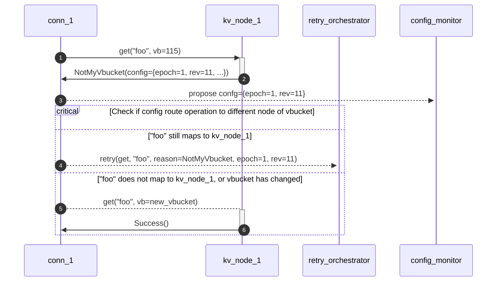

# Meta

| Field          | Value                                  |
|----------------|----------------------------------------|
| RFC Name       | Faster Failover and Configuration Push |
| RFC ID         | 75                                     |
| Start Date     | 2023-06-14                             |
| Owner          | Sergey Avseyev                         |
| Current Status | DRAFT                                  |
| Revision       | #1                                     |

# Summary

TBD

# Motivation

TBD

# Relation to Other RFCs

This RFC relates to the following documents:

* [RFC-0005][rfc-0005]: VBucket Retry Logic.

* [RFC-0024][rfc-0024]: Fast-Failover SDK.


# High-Level Design

TBD

# User-Facing API

TBD

# Implementation Details

## Protocol Changes

[https://issues.couchbase.com/browse/MB-57311]: #

### Get Cluster Config with Known Version

[https://review.couchbase.org/c/kv_engine/+/192301]: #

The KV engine introduces a new HELLO flag called `GetClusterConfigWithKnownVersion` with a value of `0x1d`. This flag
does not change the behavior of the server but allows determining if the node supports epoch-revision fields for the
`GetClusterConfig` (`0xb5`) operation. If the node acknowledges `GetClusterConfigWithKnownVersion`, then the SDK can use
the new version of the command.

Epoch and revision are signed 64-bit integers encoded in network (big-endian) order.


      Byte/     0       |       1       |       2       |       3       |
         /              |               |               |               |
        |0 1 2 3 4 5 6 7|0 1 2 3 4 5 6 7|0 1 2 3 4 5 6 7|0 1 2 3 4 5 6 7|
        +---------------+---------------+---------------+---------------+
       0| 0x80          | 0xb5          | 0x00          | 0x00          |
        +---------------+---------------+---------------+---------------+
       4| 0x00          | 0x00          | 0x00          | 0x00          |
        +---------------+---------------+---------------+---------------+
       8| 0x00          | 0x00          | 0x00          | 0x00          |
        +---------------+---------------+---------------+---------------+
      12| 0xde          | 0xad          | 0xbe          | 0xef          |
        +---------------+---------------+---------------+---------------+
      16| 0x00          | 0x00          | 0x00          | 0x00          |
        +---------------+---------------+---------------+---------------+
      20| 0x00          | 0x00          | 0x00          | 0x00          |
        +---------------+---------------+---------------+---------------+
      24| 0x42          | 0x00          | 0x00          | 0x00          |
        +---------------+---------------+---------------+---------------+
      28| 0x00          | 0x00          | 0x00          | 0x00          |
        +---------------+---------------+---------------+---------------+
      32| 0x00          | 0x00          | 0x00          | 0x00          |
        +---------------+---------------+---------------+---------------+
      36| 0x08          | 0x07          | 0x06          | 0x05          |
        +---------------+---------------+---------------+---------------+
      40| 0x04          | 0x03          | 0x02          | 0x01          |
        +---------------+---------------+---------------+---------------+
    GET_CLUSTER_CONFIG command
    Field        (offset) (value)
    Magic        (0)    : 0x80 (client request, SDK -> kv_engine)
    Opcode       (1)    : 0xb5
    Key length   (2,3)  : 0x0000
    Extra length (4)    : 0x00
    Data type    (5)    : 0x00 (RAW)
    Vbucket      (6,7)  : 0x0000
    Total body   (8-11) : 0x00000010 (16 bytes)
    Opaque       (12-15): 0xdeadbeef
    CAS          (16-23): 0x0000000000000000
    Epoch        (24-31): 0x0000000000000042 (66 in base-10)
    Revision     (32-39): 0x0102030405060708 (72623859790382856 in base-10)

If the node has a cluster configuration newer than what is specified in the example, the response will include the new
configuration in the body with the data type set to `JSON` (`0x01`). Otherwise, the response will have an empty body
with the data type `RAW` (`0x00`).

### Deduplicate Cluster Configuration for `NotMyVbucket` Responses

[https://review.couchbase.org/c/kv_engine/+/190899]: #

The KV engine introduces a new HELLO flag called `DedupeNotMyVbucketClustermap` with a value of `0x1e`. Once this flag
is negotiated, the node might send an empty body with `NotMyVbucket` (`0x07`) status codes. The KV engine tracks the
revision that has been sent to the SDK over the socket connection, so a response with a `NotMyVbucket` status will only
have a body if the pushed version is older than the active configuration.

The KV engine updates the pushed configuration version in the following cases:
* Configuration sent to the SDK in response to a `GetClusterConfig` (`0xb5`) request.
* Configuration pushed to the SDK that enabled the HELLO flag `ClustermapChangeNotification` (`0x0d`).

NOTE: `DedupeNotMyVbucketClustermap` affects `ClustermapChangeNotification` and `ClustermapChangeNotificationBrief`
features, that described below. In other words, if deduplication enabled, the cluster configuration will be announce for
the socket connection only once.

NOTE: KV engine does not inspect the body of the configuration, it only looks at `epoch`/`revision` pair to detect
duplicates (decide if the SDK seen the update). It means, that SDK still might receive updates that do not change
VBucket map or topology (number, order or names of the nodes). It is up to the SDK to decide if the configuration
affects the sockets or pipeline configuration, which must be already implemented for older generation of the servers.

### Enforcing Snappy Compression for Cluster Configuration Payloads

[https://review.couchbase.org/c/kv_engine/+/192152]: #
[https://review.couchbase.org/c/kv_engine/+/192316]: #

The KV engine introduces a new HELLO flag called `SnappyEverywhere` with a value of `0x13`. Once this flag is
negotiated, the node will always use the compressed version of the cluster configuration and data type flags will be set
to `JSON | SNAPPY` (`0x03`).

Note, that the meaning of the flag `SnappyEverywhere` is that SDK expects and properly handles compression for **ANY**
operation during communication with the KV engine, this is why the flag called "SnappyEverywhere", and not "SnappyConfig".

### `GetClusterConfig` and Out-of-Order Execution

[https://issues.couchbase.com/browse/MB-56885]: #

HELLO flag `UnorderedExecution` (`0x0e`) enables Out-of-Order (OoO) execution, so that the KV engine is being allowed to
reorder operations. [kv\_engine/docs/UnorderedExecution.md][kv-unordered-execution] provides more details on this
feature.

The `GetClusterConfig` (`0xb5`) command is explicitly marked as compatible with OoO execution, allowing it to be served
without waiting for the completion of in-flight operations. Specifically, `GetClusterConfig` will not wait for long
operations such as mutations with SyncDurability requirements. All current SDKs are expected to be compatible with the
OoO execution mode, so no changes are expected.

### Cluster Configuration Notification Changes

Prior to server version 7.6, the KV engine had an opt-in feature to push configuration updates to SDKs. This feature
could be enabled using the HELLO flag `ClustermapChangeNotification` (`0x0d`), which depends on `Duplex` (`0x0c`). More
details about `Duplex` can be found in [kv\_engine/docs/Duplex.md][kv-duplex]. When both flags are negotiated, the
server will send unsolicited configuration updates to the SDK without expecting any acknowledgement mechanism. While
this approach proves to have better responsiveness compared to [RFC-0024: Fast Failover][rfc-0024], it also has its own
drawbacks, such as:

1. The SDK subscribes all connections using HELLO, and during rebalance, all connections will receive all notifications.
2. In a Lambda scenario, if failover occurs while the SDK process is paused, upon resuming, the SDK must process all
   updates on all sockets. This process takes unnecessary time, unlike when the SDK polls every 2.5 seconds.

The SDK is not supposed to negotiate `ClustermapChangeNotification` (`0x0d`), and must use polling mechanism if brief
version is not available. `ClustermapChangeNotification` still available in post-7.6 versions.

Since version 7.6, the KV engine introduces the HELLO flag `ClustermapChangeNotificationBrief` (`0x1f`). This flag
instructs the KV engine to exclude the cluster configuration content from the notification. In this case, the data type
will be `RAW` (`0x00`). Below is the typical structure of the notification when the brief mode is enabled:


      Byte/     0       |       1       |       2       |       3       |
         /              |               |               |               |
        |0 1 2 3 4 5 6 7|0 1 2 3 4 5 6 7|0 1 2 3 4 5 6 7|0 1 2 3 4 5 6 7|
        +---------------+---------------+---------------+---------------+
       0| 0x82          | 0x01          | 0x00          | 0x00          |
        +---------------+---------------+---------------+---------------+
       4| 0x00          | 0x00          | 0x00          | 0x00          |
        +---------------+---------------+---------------+---------------+
       8| 0x00          | 0x00          | 0x00          | 0x00          |
        +---------------+---------------+---------------+---------------+
      12| 0x00          | 0x00          | 0x00          | 0x00          |
        +---------------+---------------+---------------+---------------+
      16| 0x00          | 0x00          | 0x00          | 0x00          |
        +---------------+---------------+---------------+---------------+
      20| 0x00          | 0x00          | 0x00          | 0x00          |
        +---------------+---------------+---------------+---------------+
      24| 0x42          | 0x00          | 0x00          | 0x00          |
        +---------------+---------------+---------------+---------------+
      28| 0x00          | 0x00          | 0x00          | 0x00          |
        +---------------+---------------+---------------+---------------+
      32| 0x00          | 0x00          | 0x00          | 0x00          |
        +---------------+---------------+---------------+---------------+
      36| 0x08          | 0x07          | 0x06          | 0x05          |
        +---------------+---------------+---------------+---------------+
      40| 0x04          | 0x03          | 0x02          | 0x01          |
        +---------------+---------------+---------------+---------------+
    CLUSTERMAP_CHANGE_NOTIFICATION command
    Field        (offset) (value)
    Magic        (0)    : 0x82 (server request, kv_engine -> SDK)
    Opcode       (1)    : 0x01
    Key length   (2,3)  : 0x0000
    Extra length (4)    : 0x10 (two int64_t fields in extras)
    Data type    (5)    : 0x00 (RAW)
    Vbucket      (6,7)  : 0x0000
    Total body   (8-11) : 0x00000010 (16 bytes)
    Opaque       (12-15): 0x00000000
    CAS          (16-23): 0x0000000000000000
    Epoch        (24-31): 0x0000000000000042 (66 in base-10)
    Revision     (32-39): 0x0102030405060708 (72623859790382856 in base-10)

So note that magic is `ServerRequest` (`0x82`), that is enabled by `Duplex` (`0x0c`) HELLO flag. Also note that just
like in regular cluster configuration notification, epoch and revision fields are sent as extras.

Note that the magic value for this notification is `ServerRequest` (`0x82`), which is enabled by the `Duplex` (`0x0c`)
HELLO flag. Additionally, similar to the regular cluster configuration notification, the epoch and revision fields are
sent as extras.

Once the brief cluster configuration notification is received, it is up to the SDK to decide whether to send a
`GetClusterConfig` (`0xb5`) request to retrieve the actual configuration body.

In essence, the `ClustermapChangeNotificationBrief` feature only saves network traffic. If
`DedupeNotMyVbucketClustermap` is not enabled, the number of notifications will be the same as before. However, this
feature can still be used as a building block to implement a debouncing mechanism. When properly configured, it can help
reduce the number of requests. Further details on this topic will be covered in the "Library Changes" section.

## Library Changes

### Configuration Push

The previously mentioned `ClustermapChangeNotificationBrief` feature enables the SDK to subscribe all connections for
configuration updates. These notifications are lightweight and can be deduplicated by the server when the
`DedupeNotMyVbucketClustermap` option is negotiated.

It is not guaranteed that the configuration will be immediately available on the all nodes of the cluster once one of
the node sends `CLUSTERMAP_CHANGE_NOTIFICATION` request to SDK. To workaround this issue, the SDK should remeber
`epoch`/`revision` pair from notification payload as "recently announced" version, and ensure that the configuration
monitor will continue attempts to fetch configuration until the received body will have version that is not older than
"recently announced".

As an optional optimization, the SDK might perform attempts to retrieve configuration starting from the node that
pushed configuration notification. Although it might not be possible to do easily in all SDKs.

#### Mixed Clusters

In clusters where there is a mix of nodes with older server versions, meaning that some nodes do not acknowledge
`ClustermapChangeNotificationBrief`, the respective connection should notify the configuration monitor about its lack of
support for configuration pushes from the server. As a result, the monitor should utilize the old polling mechanism for
this particular node instead.

In other words, the configuration monitor should continue polling only if there are nodes, that do not support
`ClustermapChangeNotificationBrief`, otherwise configuration monitor issue `GET_CLUSTER_CONFIG` request only when
notification arrives.

### Bootstrap Changes

[RFC-0048][rfc-0048] describes bootstrap process for the SDK and the KV connections in particular. With Faster Failover
mechanism implemented, the SDK should not start polling for the nodes, where the KV engine has acknowledged
`ClustermapChangeNotificationBrief` feature. Such connections are expected to be notified by the KV engine when the
configuration will be received.t

### Enhancements in Handling the `NotMyVbucket` Status

`DedupeNotMyVbucketClustermap` feature allows to save traffic by not sending configuration, if SDK already seen the same
revision. 

Several modifications are required in the SDK:
1. Response handler should tolerate empty response with `NotMyVbucket` status, as the KV engine assumes that the SDK
   already seen configuration, and there is no newer configuration available. In this case SDK should just retry the
   operation.

2. If the reponse payload contains body, it contains current configuration, which should be sent to configuration
   monitor (manager). The SDK should either synchronously apply configuration, create waiting queue for given
   `epoch`/`revision` pair.
   Once configuration applied, the SDK must check if new configuration routes the operation to new endpoint or new
   vbucket on the old endpoint, and *immediately* dispatch operation to new endpoint (or same endpoint in case vbucketID
   has changed). In any other case, the SDK should send operation to retry orchestrator.
   ```mermaid
   flowchart 
       A(NotMyVbucket) --> B{Empty Body?}
       B -->|No|C(Apply Configuration)
       C --> D{Route Operation}
       D -->|Endpoint Changed| E[Dispatch To<br>New Endpoint]
       D -->|VBucketID Changed| F[Update VBucketID]
       F --> G[Dispatch To<br>Same Endpoint]
       D -->|Everything Else| H[Send To Retry<br>Orchestrator]
       B -->|Yes|H[Send To Retry<br>Orchestrator]
   ```


Below is a diagram that illustrates an example of the SDK workflow



# Language Specifics

## Feature Checklist

1. `GetClusterConfigWithKnownVersion` (`0x1d`). The SDK should always supply current configuration version if the
   connection has acknowledged feature flag.

2. `DedupeNotMyVbucketClustermap` (`0x1e`). The SDK should be ready that the KV engine will not repeat configuration
   payload if it already been sent to the socket by any means (`NotMyVbucket` status, `ClustermapChangeNotification`,
   `GetClusterConfig`).

3. Out-of-Order Execution. `Duplex` (`0x0c`) feature should be always negotiated in HELLO.

4. `ClustermapChangeNotificationBrief` (`0x1f`). The SDK should always subscribe for configuration notifications, if the
   server supports it, and fallback to polling if it does not.

5. SDK-side deduplication of push notifications. SDK should track which revision was used when last `GET_CLUSTER_CONFIG`
   was sent. So that if new notification comes with the same revision or older, it should be **ignored**. It should also
   ignore notifications which `epoch`/`revision` are not newer than effective configuration that is used by the SDK.

6. [OPTIONAL] `SnappyEverywhere` (`0x13`). The SDK should be ready that KV engine might send Snappy-compressed payload with any
   of the response types (including push notifications). Check datatype `SNAPPY` (`0x02`).

7. SDK should be able to handle errors from HELLO. The error should be logged and the exception should include the
   details if it is possible. For example, Sending `ClustermapChangeNotificationBrief` (`0x1f`) without `Duplex`
   (`0x0c`) will trigger response with the status code `Einval` (`0x04`) and body
   `{"error":{"context":"ClustermapChangeNotificationBrief needs Duplex"}}`.
   See [hello\_packet\_executor.cc][kv-engine-hello-error] for more details. 

# Open Questions

1. TBD

# Revisions

* Revision #1 (2023-XX-YY; Sergey Avseyev)
    * Completed initial draft.

# Signoff

| Language    | Team Member    | Signoff Date | Revision |
|-------------|----------------|--------------|----------|
| .NET        | Jeffry Morris  |              |          |
| C/C++       | Sergey Avseyev |              |          |
| Go          | Charles Dixon  |              |          |
| Java/Kotlin | David Nault    |              |          |
| Node.js     | Jared Casey    |              |          |
| PHP         | Sergey Avseyev |              |          |
| Python      | Jared Casey    |              |          |
| Ruby        | Sergey Avseyev |              |          |
| Scala       | Graham Pople   |              |          |

[kv-unordered-execution]: https://github.com/couchbase/kv_engine/blob/master/docs/UnorderedExecution.md
[kv-duplex]: https://github.com/couchbase/kv_engine/blob/master/docs/Duplex.md
[rfc-0005]: /rfc/0005-vbucket-retries.md
[rfc-0024]: /rfc/0024-fast-failover.md
[rfc-0048]: /rfc/0048-sdk3-bootstrapping.md
[kv-engine-hello-error]: https://github.com/couchbase/kv_engine/blob/fc4e8f7a71609687302f3f54d2f5052f86105400/daemon/protocol/mcbp/hello_packet_executor.cc#L147-L152
