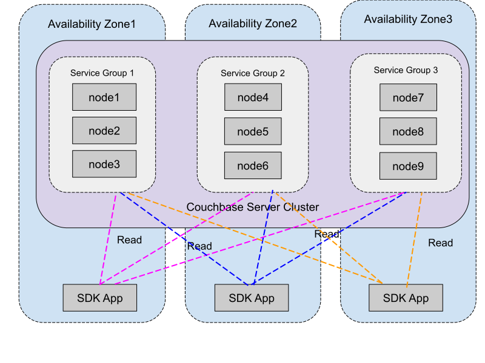
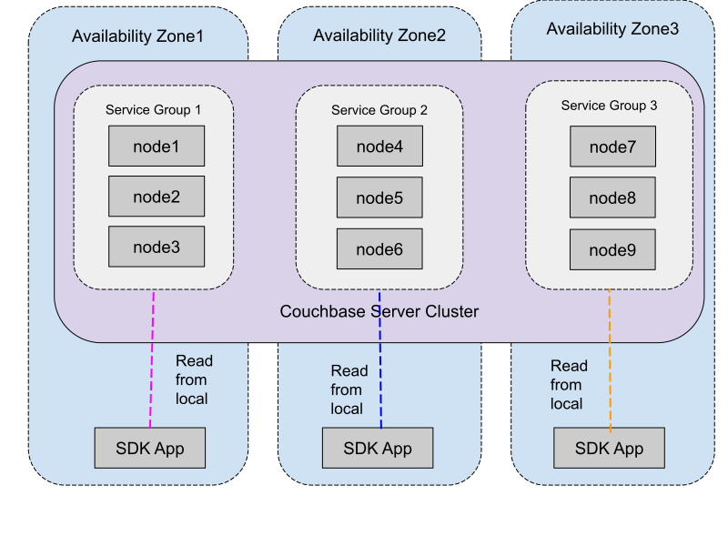
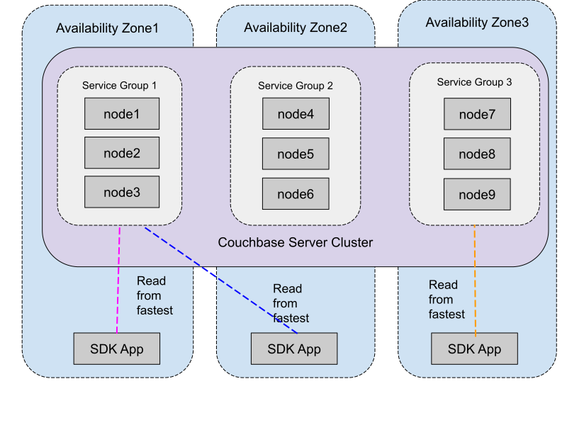

# Meta

| Field          | Value                    |
|----------------|--------------------------|
| RFC Name       | Zone-Aware Replica Reads |
| RFC ID         | 78                       |
| Start Date     | 2024-04-25               |
| Owner          | Sergey Avseyev           |
| Current Status | DRAFT                    |
| Revision       | #1                       |

# Summary

This document describes changes that SDKs must implement to optimize costs of
network traffic when the server is being deployed across multiple availability
zones.

# Motivation

Existing SDKs do not take into account node availability groups of the nodes in
the cluster. In particular, when performing `getAllReplicas` operations, the SDK
would send `GET (0x00)` request to active vBucket and `GET_REPLICA (0x83)` to
each of the replicas. This approach will make reading from replicas expensive
operations if nodes of the cluster deployed in different availability zones
(AZ).

# Use Cases

## No Preference

This is current behaviour, where the SDK does not take into account server
groups.



## Local Only

In this case, all reads will be done only from the local availability zone. It
is the cheapest solution, although it reduces chances of getting data from
replicas.



## Local First

This case is a compromise between cost and availability, which trades speed. The
idea is that the SDK will partition set of `[active, replica1, ...]` nodes into
two groups: local and non-local. Then it will perform requests to local only,
and only when neither of nodes will return data, send requests to non-local
group.



# Changes

New enumeration should be defined for expressing different strategies:

```
enum ReadPreference {
    NO_PREFERENCE,
    LOCAL_ONLY,
    LOCAL_FIRST,
};
```

Each of the operation should get new option, with default value of
`ReadPreference::NO_PREFERENCE`.

```
class GetAllReplicasOptions {
    // ...
    ReadPreference readPreference { ReadPreference::NO_PREFERENCE };
    // ...
};
```

```
class GetAnyReplicaOptions {
    // ...
    ReadPreference readPreference { ReadPreference::NO_PREFERENCE };
    // ...
};
```

```
class LookupInAllReplicasOptions {
    // ...
    ReadPreference readPreference { ReadPreference::NO_PREFERENCE };
    // ...
};
```

```
class LookupInAnyReplicaOptions {
    // ...
    ReadPreference readPreference { ReadPreference::NO_PREFERENCE };
    // ...
};
```

In all failure cases, when the SDK cannot handle operation, it must return `102
DocumentUnretrievable` with human-readable explanation whenever it is possible
that explains the details.

# Open Questions

## Q1

What the SDK should do if the local group does not have any replica configured
for the key, but the User request `Local-Only` strategy? Consider the following
cases:

- number of replicas is 1, number of zones is 3. Neither active, nor replica is
  in the local group.
- number of replicas is 1, number of zones is 3. Only active node is in the
  local group.
- number of replicas is 1, number of zones is 3. Only replica node is in the
  local group.

Shall we warn users when locality restriction turns request into just GET,
because only active node is in local group?

## Q2

Do we need to implement management API to create/retrieve server groups and
change node belonging to particular group?

## Q3

All currently supported server versions allow to configure server groups, but
only 7.6.1 announce this information in configuration.
[MB-60835](https://issues.couchbase.com/browse/MB-60835) How the SDK should
behave with older server? Do we need to fail fast or silently fall back to
current behavior?

## Q4

Is there explicit statement from the server team that mixed-version cluster will
not announce feature until all nodes migrated to 7.6.1?

## Q5

Moving nodes between groups generates configuration, but does not really moves
data. The user might forget to trigger rebalance, and the SDK will try to do
Local-Only or Local-First strategy, while the operations are still expensive.

## Q6

How the SDK should behave during rebalance? It cannot guarantee cheap traffic
based on availability. Should we retry operations if the configuration says that
replica has moved to different group?

## Q7

In case of more than two server groups configured, do we need to distinguish
between non-local groups? Right now there is no weights associated with the
groups, so we don't have enough information to reason about cost of
communication with non-local groups.

## Q8

Do we want to update GetResult and LookupInResult with the property, which would
tell the user the name of the availability zone, where serving node has been
deployed upon generating response?

# Changelog
* April 25 2024 - Revision #1
  * Initial Draft

# Signoff

| Language    | Team Member    | Signoff Date | Revision |
|-------------|----------------|--------------|----------|
| .NET        |                | 2024-MM-DD   |          |
| Go          |                | 2024-MM-DD   |          |
| C/C++       |                | 2024-MM-DD   |          |
| Node.js     |                | 2024-MM-DD   |          |
| PHP         |                | 2024-MM-DD   |          |
| Python      |                | 2024-MM-DD   |          |
| Ruby        |                | 2024-MM-DD   |          |
| Java        |                | 2024-MM-DD   |          |
| Kotlin      |                | 2024-MM-DD   |          |
| Scala       |                | 2024-MM-DD   |          |
