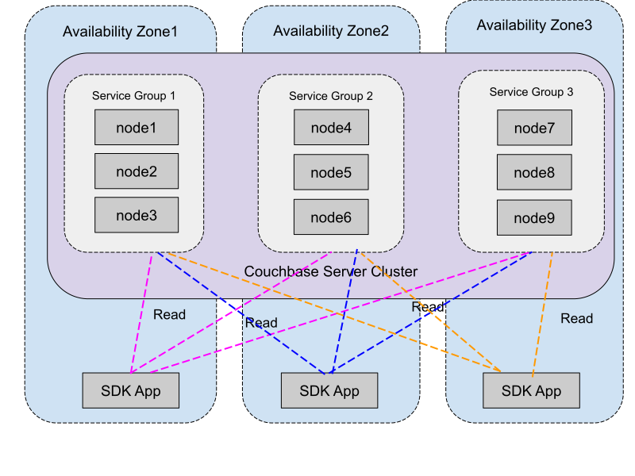
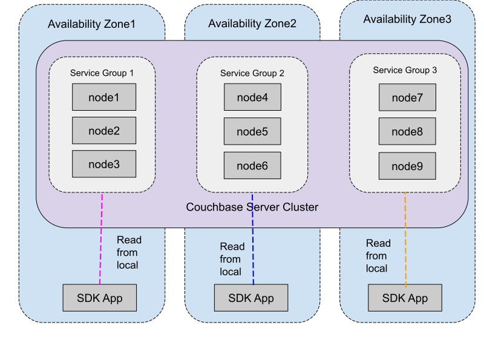
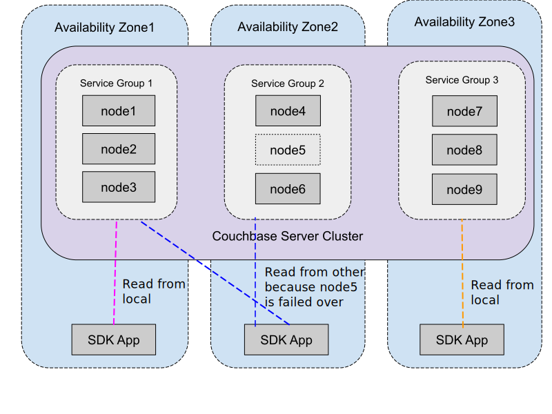

# Meta

| Field          | Value                    |
|----------------|--------------------------|
| RFC Name       | Zone-Aware Replica Reads |
| RFC ID         | 78                       |
| Start Date     | 2024-04-25               |
| Owner          | Sergey Avseyev           |
| Current Status | DRAFT                    |
| Revision       | #1                       |

# Summary

This document describes changes that SDKs must implement to optimize costs of
network traffic when the server is being deployed across multiple availability
zones.

# Motivation

Existing SDKs do not take into account node availability groups of the nodes in
the cluster. In particular, when performing `getAllReplicas` operations, the SDK
would send `GET (0x00)` request to active vBucket and `GET_REPLICA (0x83)` to
each of the replicas. This approach will make reading from replicas expensive
operations if nodes of the cluster deployed in different availability zones
(AZ).

# Use Cases

## No Preference

This is current behaviour, where the SDK does not take into account server
groups.



## Selected Server Group

In this case, all reads will be done only from the selected server group. It
is the cheapest solution, although it reduces chances of getting data from
replicas (if the server groups are unbalanced).



## Selected Server Group or All Available

This strategy allows using all available replicas, but only in case when the
local server group is empty. The selected server group might be empty in case
the groups are not balanced properly on the cluster, or some nodes has been
failed over. The previous strategy in this case would return
`102 DocumentUnretrievable` error and refuse touching replicas from non-local
group.



In general, the user must be expecting that the document will not be available
in local group, so

```
try {
   return collection.getAnyReplica(docId,
                                   options()
                                    .timeout("20ms")
                                    .read_preference(SELECTED_SERVER_GROUP))
} catch DocumentUnretrievableException | DocumentNotFoundException {
  return collection.get(docId)
  // or collection.getAnyReplica(docId)
  // or collection.getAllReplicas(docId)
}
```

# Changes

## Updates in Configuration Parser

Each node in `nodesExt` array of cluster configuration will have new property
`serverGroup`, which contains name of the group as it seen in Admin UI. For
example:

```jsonc
{
    // ...
    "vBucketServerMap": {
        "vBucketMap": [
            [ 0, 1 ]
            // ... other vBuckets
        ]
    },
    // ...
    "nodesExt": [
        {
            // ...
            "hostname": "172.17.0.2",
            "serverGroup": "group_1"
        },
        {
            // ...
            "hostname": "172.17.0.3",
            "serverGroup": "group_2"
        },
        {
            // ...
            "hostname": "172.17.0.4",
            "serverGroup": "group_2"
        },
        {
            // ...
            "hostname": "172.17.0.5",
            "serverGroup": "group_1"
        }
    ]
    // ...
}
```

Having this information, the SDK will be able to filter list of the node
indexes in `vBucketMap` to get local server group members.

For example, lets say the configured SDK to use `"group_1"` as its local server
group. Then if some key is mapped to vBucket `0`, the SDK can filter vector if
indexes `[0, 1]` to only `[0, -1]` (using `-1` here for illustration), because
server with index `1` belongs to `"group_2"`. In the result, the SDK only need
to send `GET` request to retrieve active copy of the document.

## Selecting Server Group for Connection

To allow user to select preferred server groups, new setter/property for
`ClusterOptions` must be introduced:

```
class ClusterOptions {
    // ...
    ClusterOptions preferredServerGroup(String serverGroupName);
    // ...
}
```

Where `serverGroupName` matches name of the group as it seen in Admin UI of the
server and in cluster configuration JSON.

## Selecting Read Preference for Operations

New enumeration should be defined for expressing different strategies for the
read replica APIs:

```
enum ReadPreference {
    NO_PREFERENCE,
    SELECTED_SERVER_GROUP,
};
```

Each of the operation should get new option, with default value of
`ReadPreference::NO_PREFERENCE`.

```
class GetAllReplicasOptions {
    // ...
    ReadPreference readPreference { ReadPreference::NO_PREFERENCE };
    // ...
};
```

```
class GetAnyReplicaOptions {
    // ...
    ReadPreference readPreference { ReadPreference::NO_PREFERENCE };
    // ...
};
```

```
class LookupInAllReplicasOptions {
    // ...
    ReadPreference readPreference { ReadPreference::NO_PREFERENCE };
    // ...
};
```

```
class LookupInAnyReplicaOptions {
    // ...
    ReadPreference readPreference { ReadPreference::NO_PREFERENCE };
    // ...
};
```

In all failure cases, when the SDK cannot handle operation, it must return `102
DocumentUnretrievable` with human-readable explanation whenever it is possible
that explains the details.

## Transactions

Inside transaction closure, the replica read API takes simplified form, and
always read from local group, which implies that the SDK will always throw `102
DocumentUnretrievable` error for servers that do not expose `serverGroup`
property in cluster configuration.

```
class TransactionAttemptContext {
  // ...
  public TransactionGetResult
  getReplicaFromPreferredServerGroup(Collection collection, String id,
                                     TransactionGetReplicaOptions options);
  // ...
}
```

`TransactionGetReplicaOptions` here does not have any specific options except
common with `get()` method. The user cannot select read preference.

```
class TransactionGetReplicaOptions {
    Transcoder transcoder;
}
```

The method might throw the following errors:

* `101 DocumentNotFound`, when the server returns KV Code `0x01 ENOENT` for
  *all* requests.

* `102 DocumentUnretrievable`, when the SDK finds that there are nodes in local
  group, or there is no group available with the name selected in connection
  options.

# Caveats

The user must be aware of the following topics when dealing with
Zone-Aware-Replica-Reads:

- Regardless the fact that the Couchbase supports Server Groups for a long time
  already, the SDK can see them in configuration since 7.6.2 release only, which
  make Zone-Aware-Replica-Reads to be available only in most recent releases.

- It is crucial to perform rebalance after setting up server groups, as only
  after this process the data will be physically moved.

- The User must consult server documentation regarding setting up balanced
  cluster for efficient usage of the feature. Number of the replicas and number
  of the groups have to be carefully selected.

# Open Questions

## Q1

> What the SDK should do if the local group does not have any replica configured
> for the key, but the User request `Selected-Server-Group` strategy? Consider
> the following cases:
>
> - number of replicas is 1, number of zones is 3. Neither active, nor replica
>   is in the local group.
> - number of replicas is 1, number of zones is 3. Only active node is in the
>   local group.
> - number of replicas is 1, number of zones is 3. Only replica node is in the
>   local group.
>
> Shall we warn users when locality restriction turns request into just GET,
> because only active node is in local group?

The SDK should just implement two strategy, described in the body of the RFC.
Although future editions might add more strategies with retrying with full
replica-set or performing extra validations.

## Q2

> Do we need to implement management API to create/retrieve server groups and
> change node belonging to particular group?

No, we do not need to implement management API. If necessary, REST API should be
used
(https://docs.couchbase.com/server/current/manage/manage-groups/manage-groups.html)
`cbdinocluster` also support server groups since version 0.0.43.

## Q3

> All currently supported server versions allow to configure server groups, but
> only 7.6.1 announce this information in configuration.
> [MB-60835](https://issues.couchbase.com/browse/MB-60835) How the SDK should
> behave with older server? Do we need to fail fast or silently fall back to
> current behavior?

The behavior of this feature with older servers (pre 7.6.2) is not defined. The
User might handle it will falling back to get from active or any of the old APIs
see the fall back snippet in the RFC body.


## Q4

> Is there explicit statement from the server team that mixed-version cluster will
> not announce feature until all nodes migrated to 7.6.1?

No expectation of mixed mode support. The feature requires all nodes to be on
server 7.6.2+, otherwise behavior left undefined. In 7.7, when we have
capability flags, we could support mixed mode.

## Q5

> Moving nodes between groups generates configuration, but does not really moves
> data. The user might forget to trigger rebalance, and the SDK will try to do
> `Selected-Server-Group` strategy, while the operations are still expensive.

The sever generates notice in UI warning the user that rebalance is necessary.
The SDK should not detect whether the vBucket moved or not, and just trust the
vBucketMap in the configuration.

## Q6

> How the SDK should behave during rebalance? It cannot guarantee cheap traffic
> based on availability. Should we retry operations if the configuration says that
> replica has moved to different group?

Rebalance should be considered a transient state and the SDK cannot make any
guarantees about physical location of the vBuckets in the cluster. We just wait
until the cluster returns into balanced state and meanwhile we just trust the
vBucketMap in the configuration.

## Q7

> In case of more than two server groups configured, do we need to distinguish
> between non-local groups? Right now there is no weights associated with the
> groups, so we don't have enough information to reason about cost of
> communication with non-local groups.

The SDK does not reason about any other groups but the one that selected as
preferred.

## Q8

> Do we want to update `GetResult` and `LookupInResult` with the property, which
> would tell the user the name of the availability zone, where serving node has
> been deployed upon generating response?

Right now the structure of responses remains unchanged.

# Changelog
* April 25 2024 - Revision #1
  * Initial Draft

# Signoff

| Language    | Team Member    | Signoff Date | Revision |
|-------------|----------------|--------------|----------|
| .NET        |                | 2024-MM-DD   |          |
| Go          |                | 2024-MM-DD   |          |
| C/C++       | Sergey Avseyev | 2024-06-10   | #1       |
| Node.js     |                | 2024-MM-DD   |          |
| PHP         |                | 2024-MM-DD   |          |
| Python      |                | 2024-MM-DD   |          |
| Ruby        | Sergey Avseyev | 2024-06-10   | #1       |
| Java        |                | 2024-MM-DD   |          |
| Kotlin      |                | 2024-MM-DD   |          |
| Scala       |                | 2024-MM-DD   |          |
